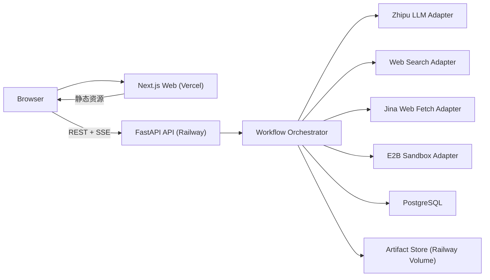
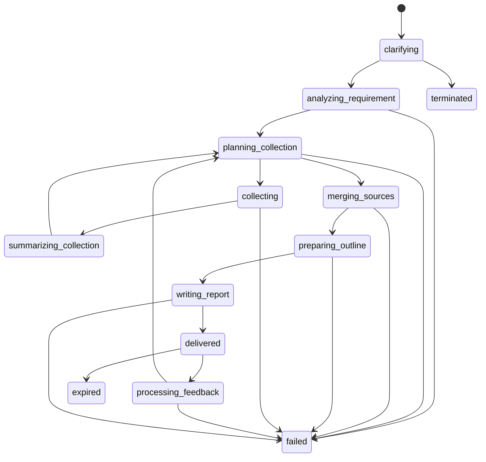

# Mimir Architecture

## 1. 文档目的

本文档基于 [PRD 0.3](/Users/aminer/Library/CloudStorage/OneDrive-个人/projects/Mimir/docs/Mimir_v1.0.0_prd_0.3.md) 输出正式开发前的技术与架构设计，目标是把产品需求收敛为可执行的工程方案，覆盖以下内容：

- 前后端解耦方式与整体系统结构
- 后端目录结构与模块职责
- 核心 Agent 之间传递的数据结构（Schema）
- 前后端 API 接口契约与流式事件协议
- 数据存储、清理、风控、断连、限流等关键非功能设计
- TDD 开发顺序与测试边界

本文档只做架构与技术规划，不进入业务代码实现。

## 2. 架构原则

### 2.1 总体原则

1. 严格前后端解耦。
2. 后端必须可以在未来独立对外提供完整 API 服务。
3. 不使用 LangChain、LangGraph 或其他 Agent 编排框架，所有 Agent loop 手工实现。
4. 采用 contract-first + TDD 开发方式。
5. 所有长耗时阶段都必须可流式输出到前端。
6. 所有研究相关数据默认短期存活，严格执行删除策略。
7. 当前版本只支持“全局同一时刻一个研究任务”，优先保证行为确定性和可观测性，而不是横向扩展。

### 2.2 技术选型

#### 前端

- `Next.js`（App Router）
- `TailwindCSS`
- `shadcn/ui`
- `react-markdown` + `rehype-sanitize` 用于安全渲染报告
- `@microsoft/fetch-event-source` 或等价 `fetch + ReadableStream` 方案，用于带 Header 的 SSE 连接
- 浏览器直连后端 API 与 SSE，不引入 Next.js BFF

#### 后端

- `Python 3.12+`
- `FastAPI`
- `Pydantic v2`
- `SQLAlchemy 2.0` + `Alembic`
- `PostgreSQL` 作为主存储
- `httpx` 作为底层 HTTP 客户端
- 智谱官方 SDK 作为主 LLM 访问方式
- `E2B Sandbox API` 用于 `python_interpreter`

#### 部署

- 前端部署到 `Vercel`
- 后端部署到 `Railway`
- 后端默认挂载 Railway Volume 作为临时制品目录

### 2.3 关键决策

#### 决策 A: 流式协议使用 SSE，而不是 WebSocket

原因：

- PRD 的核心交互是单向流式展示，不需要频繁双向实时通信
- 浏览器接入简单，和 FastAPI 集成成本低
- 对前后端完全解耦更友好
- 更利于“事件日志 + 回放”的实现

#### 决策 B: 后端采用显式状态机 + 显式编排器

原因：

- PRD 中 func_7~func_10、func_15 有明确循环、分支、限次、回退与异常处理
- 手工编排比通用 Agent 框架更容易保证精确实现
- 更易测试、回放、调试和做风控处理

#### 决策 C: 任务使用 Task / Revision 二层模型

原因：

- 一次“研究任务”在交付后还能接受多轮反馈
- 反馈后需要重新生成需求详情并继续搜集与撰写
- PRD 0.3 明确要求反馈后不删除已搜集信息

因此：

- `Task` 表示从首次输入到最终过期/删除的整段生命周期
- `Revision` 表示首次输出或每次反馈后的一轮重跑

补充说明：

- PRD 0.3 的版本历史写明“反馈重启逻辑不删除已收集信息”
- 架构实现以 2026-03-12 更新的 PRD 0.3 版本历史和 `func_15` 详细说明为准

## 3. 建议仓库结构

建议将仓库整理为 Monorepo，但前后端边界保持明确：

```text
Mimir/
├─ apps/
│  └─ web/                      # Next.js 前端
├─ services/
│  └─ api/                      # FastAPI 后端
├─ packages/
│  └─ contracts/                # OpenAPI / JSON Schema / TS types
├─ docs/
│  ├─ Mimir_v1.0.0_prd_0.3.md
│  └─ Architecture.md
└─ scripts/
```

### 3.1 前端目录建议

```text
apps/web/
├─ app/
├─ components/
├─ features/
│  └─ research/
│     ├─ components/
│     ├─ hooks/
│     ├─ schemas/
│     └─ stores/
├─ lib/
│  ├─ api/
│  ├─ sse/
│  └─ utils/
├─ styles/
└─ tests/
```

前端职责只包括：

- 研究输入与配置
- 澄清交互
- 流式事件渲染
- 报告 markdown / 图片展示
- 下载与反馈入口

前端不承担：

- 业务编排
- Prompt 拼接
- 工具调用
- 数据持久化

### 3.2 后端目录建议

```text
services/api/
├─ app/
│  ├─ main.py
│  ├─ api/
│  │  ├─ deps.py
│  │  ├─ error_handlers.py
│  │  └─ v1/
│  │     ├─ router.py
│  │     ├─ health.py
│  │     ├─ tasks.py
│  │     ├─ events.py
│  │     └─ downloads.py
│  ├─ application/
│  │  ├─ dto/
│  │  ├─ commands/
│  │  ├─ services/
│  │  ├─ use_cases/
│  │  ├─ orchestrators/
│  │  └─ policies/
│  ├─ domain/
│  │  ├─ enums.py
│  │  ├─ models/
│  │  ├─ value_objects/
│  │  └─ services/
│  ├─ infrastructure/
│  │  ├─ db/
│  │  │  ├─ models/
│  │  │  ├─ repositories/
│  │  │  └─ migrations/
│  │  ├─ llm/
│  │  │  ├─ zhipu_client.py
│  │  │  ├─ parsers/
│  │  │  └─ prompts/
│  │  ├─ tools/
│  │  │  ├─ web_search_client.py
│  │  │  ├─ web_fetch_client.py
│  │  │  └─ e2b_client.py
│  │  ├─ storage/
│  │  ├─ streaming/
│  │  ├─ security/
│  │  └─ observability/
│  └─ core/
│     ├─ config.py
│     ├─ clock.py
│     ├─ ids.py
│     ├─ json.py
│     └─ retry.py
├─ tests/
│  ├─ unit/
│  ├─ contract/
│  ├─ integration/
│  └─ e2e/
└─ pyproject.toml
```

## 4. 运行时架构



### 4.1 核心模块

#### API Layer

- 提供 REST 接口
- 提供 SSE 事件流
- 负责请求校验、鉴权、状态检查、错误映射

#### Workflow Orchestrator

- 驱动整个任务状态机
- 管理 revision 生命周期
- 驱动 master/sub agent loop
- 负责取消、重试、风控回退、断连终止

#### External Adapters

- 智谱 LLM 调用
- 智谱 `web_search`
- Jina `web_fetch`
- E2B `python_interpreter`

#### Persistence

- 存储任务状态、事件流、Agent loop、搜集结果、报告与制品元数据

#### Artifact Store

- 临时保存图片、markdown zip、pdf
- 随任务清理一起删除

## 5. 任务模型与状态机

## 5.1 核心实体

### Task

表示单次研究会话，含首次输入、交付、反馈、过期、删除等完整生命周期。

### Revision

表示 Task 内的一轮产出版本：

- `rev_1`: 初始需求产生的首轮版本
- `rev_n`: 基于用户反馈产生的后续版本

实现约束：

- 对外暴露的 `revision_id` 使用不可枚举的 opaque id，例如 `rev_01H...`
- Task 内部另存一个单调递增的 `revision_number`
- 文档中使用 `rev_1` 的地方仅作为阅读示意，不作为最终 ID 生成规则

### SubTask

表示 master agent 一次工具调用创建的单个搜集目标执行单元，对应 PRD 中的 `collect_agent`。

### Event

表示发往前端的流式 UI 事件，也是后端的可回放事件日志。

## 5.2 Task 状态

建议将 `status` 和 `phase` 分离。

### status

- `running`
- `awaiting_user_input`
- `awaiting_feedback`
- `terminated`
- `failed`
- `expired`
- `purged`

### phase

- `clarifying`
- `analyzing_requirement`
- `planning_collection`
- `collecting`
- `summarizing_collection`
- `merging_sources`
- `preparing_outline`
- `writing_report`
- `delivered`
- `processing_feedback`

### 5.2.1 `status × phase` 合法组合

| status | 合法 phase | 说明 |
| --- | --- | --- |
| `awaiting_user_input` | `clarifying` | 仅在澄清问题已生成、等待用户输入或选单提交时出现 |
| `running` | `clarifying`, `analyzing_requirement`, `planning_collection`, `collecting`, `summarizing_collection`, `merging_sources`, `preparing_outline`, `writing_report`, `processing_feedback` | 所有活跃执行阶段 |
| `awaiting_feedback` | `delivered` | 报告已交付，等待用户反馈 |
| `expired` | `delivered` | 报告交付后 30 分钟未继续操作而过期 |
| `terminated` | 任一活跃 phase 或 `delivered` | 保留终止发生时的 phase 以便调试与审计 |
| `failed` | 任一活跃 phase 或 `delivered` | 保留失败发生时的 phase 以便调试与审计 |
| `purged` | 不对前端暴露 | 数据已物理清理，仅作为内部清理终态 |

补充规则：

1. `clarifying` 既可能是 `running`，也可能是 `awaiting_user_input`。前者表示系统正在生成澄清内容，后者表示已生成完毕并等待用户。
2. `processing_feedback` 不再拆分新 phase；其内部显式包含“反馈需求分析 LLM -> 生成新的 RequirementDetail -> 切换 revision 编排”的子步骤。
3. `delivered` 不是运行态。到达 `delivered` 后，`status` 只能是 `awaiting_feedback`、`expired`、`terminated` 或 `failed`。

## 5.3 状态流转



补充说明：

1. 为避免状态图过于拥挤，图中未逐一画出所有通用边。实际上所有活跃 phase 在显式终止请求到达时都允许流转到 `terminated`。
2. 同样地，所有活跃 phase 在通用异常重试耗尽时都允许流转到 `failed`。
3. `processing_feedback` 内部先完成 feedback analyzer LLM 调用，生成新的 `RequirementDetail` 后，才进入下一轮 `planning_collection`。

### 5.4 关键规则

1. Task 创建后立即占用“全局唯一活动任务锁”。
2. 交付后的 Task 进入 `awaiting_feedback`，最多保留 30 分钟。
3. 用户提交反馈时，创建新 Revision，不删除已有搜集结果。
4. Task 默认在后端异步持续运行；只有显式终止请求到达时才进入 `terminated` 并清理。
5. 任一阶段遇到非风控异常，按统一重试策略处理；超限后 `failed`。
6. 任何终止态都必须触发清理作业。

## 6. 后端模块职责

### 6.1 Application 层

负责业务编排，不直接操作具体 SDK。

建议包含以下 Use Cases：

- `CreateTask`
- `StreamTaskEvents`
- `SubmitClarification`
- `SubmitFeedback`
- `TerminateTaskOnDisconnect`
- `GenerateMarkdownZip`
- `GeneratePdf`

建议包含以下 Orchestrators：

- `TaskOrchestrator`
- `RevisionOrchestrator`
- `ClarificationOrchestrator`
- `MasterPlanningOrchestrator`
- `CollectSubTaskOrchestrator`
- `ReportWritingOrchestrator`

建议包含以下 Policies：

- `RetryPolicy`
- `RiskControlPolicy`
- `TaskQuotaPolicy`
- `DisconnectPolicy`
- `CleanupPolicy`

### 6.2 Domain 层

只放纯业务规则与领域对象，不依赖 FastAPI 或 SDK。

重点对象：

- `ResearchTask`
- `TaskRevision`
- `RequirementDetail`
- `ClarificationForm`
- `CollectPlan`
- `CollectResult`
- `CollectSummary`
- `FormattedSource`
- `OutlinePackage`
- `ReportBundle`
- `TaskEvent`

重点领域服务：

- `TaskStateMachine`
- `SameSourceMergeService`
- `OutputFormatMapper`
- `FreshnessPolicyMapper`
- `ArtifactManifestBuilder`

### 6.3 Infrastructure 层

负责所有外部系统交互。

#### LLM Adapter

- 调智谱官方 SDK
- 统一封装流式 token、reasoning token、finish reason、tool calls
- 解析 PRD 要求的 JSON 输出
- JSON 解析允许先安全提取首个完整 top-level JSON object / array，以兼容模型在 JSON 前后的说明性文本；该策略只做提取，不做 auto-repair，不发明模型未给出的字段或结构

#### Tool Adapters

- `WebSearchClient`
- `WebFetchClient`
- `E2BSandboxClient`

#### Persistence

- SQLAlchemy models
- repositories
- migrations

#### Streaming

- SSE broker
- event serialization

#### Security

- task token 签发与校验
- IP 限流
- 来源校验与 CORS
- 短期下载签名与 artifact 访问签名

## 7. 核心 Schema 设计

说明：

1. LLM 输出格式严格遵循 PRD。
2. LLM 原始输出进入 parser 后，转换为后端内部规范化 schema。
3. Agent 之间传递的一律使用内部规范化 schema，避免直接依赖 LLM 原始 JSON 形态。

## 7.1 TaskSnapshot

前后端共享的任务快照。

```json
{
  "task_id": "tsk_01H...",
  "status": "running",
  "phase": "clarifying",
  "active_revision_id": "rev_01H...",
  "active_revision_number": 1,
  "clarification_mode": "natural",
  "created_at": "2026-03-13T14:30:00+08:00",
  "updated_at": "2026-03-13T14:30:05+08:00",
  "expires_at": null,
  "available_actions": ["submit_clarification"]
}
```

## 7.2 ResearchConfig

```json
{
  "clarification_mode": "natural"
}
```

字段说明：

- `clarification_mode`: `natural | options`

## 7.3 ClarificationQuestionSet

选单澄清使用。

```json
{
  "questions": [
    {
      "question_id": "q_1",
      "question": "这次研究更偏向哪个方向？",
      "options": [
        { "option_id": "o_1", "label": "行业现状与趋势" },
        { "option_id": "o_2", "label": "主要参与者与格局" },
        { "option_id": "o_3", "label": "商业机会与风险" },
        { "option_id": "o_auto", "label": "自动" }
      ]
    }
  ]
}
```

说明：

- `o_auto` 不依赖 LLM 生成，由后端统一追加
- 前端默认全选 `o_auto`
- 选单解析必须在后端 parser 层完成，前端只渲染结构化 `questions`
- 若 LLM 输出无法被稳定解析为问题-选项结构，后端应回退到自然语言澄清，并发出 `clarification.fallback_to_natural` 事件

## 7.4 ClarificationSubmission

### 自然语言模式

```json
{
  "mode": "natural",
  "answer_text": "重点看中国市场，偏商业分析，最好覆盖近两年变化。"
}
```

### 选单模式

```json
{
  "mode": "options",
  "submitted_by_timeout": true,
  "answers": [
    {
      "question_id": "q_1",
      "selected_option_id": "o_2",
      "selected_label": "主要参与者与格局"
    }
  ]
}
```

## 7.5 RequirementDetail

这是后续所有 Agent 的标准输入。

```json
{
  "research_goal": "分析中国 AI 搜索产品的竞争格局与机会",
  "domain": "互联网 / AI 产品",
  "requirement_details": "偏商业报告，关注中国市场，重点覆盖近两年变化，输出语言为中文。",
  "output_format": "business_report",
  "freshness_requirement": "high",
  "language": "zh-CN",
  "raw_llm_output": {
    "研究目标": "分析中国 AI 搜索产品的竞争格局与机会",
    "所属垂域": "互联网 / AI 产品",
    "需求明细": "偏商业报告，关注中国市场，重点覆盖近两年变化，输出语言为中文。",
    "适用形式": "商业报告",
    "时效需求": "是"
  }
}
```

说明：

- `output_format` 内部统一枚举：
  - `general`
  - `research_report`
  - `business_report`
  - `academic_paper`
  - `deep_article`
  - `guide`
  - `shopping_recommendation`
- `freshness_requirement` 内部统一枚举：
  - `high`
  - `normal`
- `language` 虽不在 PRD LLM JSON 顶层字段中，但应在 parser 阶段强制抽取并结构化

## 7.6 CollectPlan

master agent 发给 sub agent 的标准结构。

```json
{
  "tool_call_id": "call_01H...",
  "revision_id": "rev_01H...",
  "collect_target": "收集 2024-2026 年中国 AI 搜索产品的主要厂商、产品定位与公开进展",
  "additional_info": "优先官方发布、主流媒体、行业研究；关注时效性；中文输出。",
  "freshness_requirement": "high"
}
```

约束：

- 单轮最多 3 个 `CollectPlan`
- 单个 Revision 累计最多 5 次 `collect_agent` 调用
- 达到累计上限时，跳过本轮收集，直接进入搜集结果汇总（merge），不终止任务
- planner 返回空 plans（stop=false）且已有搜集数据时，视为隐式停止，进入搜集结果汇总（merge）；首轮空 plans 仍终止任务

## 7.7 CollectResult

sub agent 结束后产生的原始搜集结果。

```json
{
  "subtask_id": "sub_01H...",
  "tool_call_id": "call_01H...",
  "collect_target": "收集 2024-2026 年中国 AI 搜索产品的主要厂商、产品定位与公开进展",
  "status": "completed",
  "search_queries": [
    "中国 AI 搜索 产品 2025",
    "AI 搜索 中国 厂商 2024 2026"
  ],
  "tool_call_count": 4,
  "items": [
    {
      "info": "某产品在 2025 年发布企业版能力，主要面向金融和政企客户。",
      "title": "某公司发布会回顾",
      "link": "https://example.com/article"
    }
  ]
}
```

字段说明：

- `status`: `completed | partial | risk_blocked`
- `tool_call_count`: sub agent 内部工具调用次数，最大 10

## 7.8 CollectSummary

sub agent 给 master 的压缩摘要。

```json
{
  "tool_call_id": "call_01H...",
  "subtask_id": "sub_01H...",
  "collect_target": "收集 2024-2026 年中国 AI 搜索产品的主要厂商、产品定位与公开进展",
  "status": "completed",
  "search_queries": [
    "中国 AI 搜索 产品 2025",
    "AI 搜索 中国 厂商 2024 2026"
  ],
  "key_findings_markdown": "- 市场上已有多家产品进入垂直场景。\n- 官方披露更多集中在 2025 年后。"
}
```

如果触发 func_17 指定风控异常，则统一转换为：

```json
{
  "tool_call_id": "call_01H...",
  "subtask_id": "sub_01H...",
  "status": "risk_blocked",
  "message": "触发风控敏感，请重新规划"
}
```

## 7.9 FormattedSource

搜集结果汇总后的标准信息源结构。

```json
{
  "refer": "ref_1",
  "title": "某公司发布会回顾",
  "link": "https://example.com/article",
  "info": "某产品在 2025 年发布企业版能力，主要面向金融和政企客户。\n同源页面中补充的另一条关键信息。"
}
```

说明：

- `refer` 在去重后重新顺序编号
- `info` 为同源聚合后的文本
- Writer 只能引用 `FormattedSource.refer`

## 7.10 OutlinePackage

研究输出准备阶段产物。

内部结构建议使用“有序数组”，不要直接使用动态 key 的字典，便于前端和测试处理。

```json
{
  "title": "中国 AI 搜索产品竞争格局研究",
  "sections": [
    {
      "section_id": "section_1",
      "title": "研究背景与问题定义",
      "description": "界定研究范围，说明市场背景、问题边界与分析框架。",
      "order": 1
    },
    {
      "section_id": "section_2",
      "title": "主要参与者与产品定位",
      "description": "分析代表性产品的定位、能力侧重点与目标用户。",
      "order": 2
    }
  ],
  "entities": ["AI 搜索产品", "中国市场", "厂商竞争格局"],
  "raw_llm_output": {}
}
```

说明：

- Prompt 仍按 PRD 的 JSON 结构输出
- Parser 将其转换为 `title + sections[] + entities[]`

## 7.11 PythonArtifact

`python_interpreter` 工具返回的图片制品结构。

```json
{
  "artifact_id": "art_01H...",
  "filename": "chart_market_share.png",
  "mime_type": "image/png",
  "storage_key": "tasks/tsk_x/rev_01H/artifacts/chart_market_share.png",
  "canonical_path": "mimir://artifact/art_01H..."
}
```

说明：

- `delivery.artifacts[].url` 与正文 markdown 中的图片引用不是同一概念。
- `delivery.artifacts[].url` 是短期访问地址，只用于在线访问与下载，不可作为正文持久 source of truth。
- 正文 markdown 中的 canonical 图片引用统一使用 `mimir://artifact/{artifact_id}`。
- canonical path 必须只表达“正文里引用的是哪一个 artifact”，不能携带 `access_token`、过期时间或部署域名。

## 7.11.1 PythonToolResult

`python_interpreter` 调用回放到 writer transcript 的标准结构。

```json
{
  "success": true,
  "summary": "已生成 1 张图表，并完成均值、增长率与象限坐标计算。",
  "stdout": "mean=17.4\ngrowth=0.31",
  "stderr": null,
  "error_type": null,
  "error_message": null,
  "traceback_excerpt": null,
  "artifacts": [
    {
      "artifact_id": "art_01H...",
      "filename": "chart_market_share.png",
      "mime_type": "image/png",
      "canonical_path": "mimir://artifact/art_01H..."
    }
  ]
}
```

规则：

- `success` 必填。`true` 表示 Python 代码已执行完成；`false` 表示 sandbox 已正常返回执行结果，但代码在沙盒内部失败。
- `summary` 必填；即使本次 Python 调用没有生成图片，也必须返回文本摘要。
- `stdout` 必填；允许为空字符串，但必须经过合理截断。
- `stderr`、`error_type`、`error_message`、`traceback_excerpt` 在失败时可填写，在成功时应为 `null` 或空字符串。
- `artifacts` 可为空；`python_interpreter` 既可做绘图，也可只做分析/计算。
- writer 必须基于真实 `artifacts[]` 元数据插入 markdown 图片引用，不能自行猜测 `artifacts/{filename}` 或其他离线路径。
- 沙盒内部代码执行失败属于 agent loop 内部可恢复失败，不默认等同于 Task 级 `upstream_service_error`；writer 可以基于错误信息修正代码、放弃图表或继续正文。

## 7.12 ReportBundle

Writer 阶段最终交付结构。

```json
{
  "revision_id": "rev_01H...",
  "markdown": "# 中国 AI 搜索产品竞争格局研究\n...",
  "artifacts": [
    {
      "artifact_id": "art_01H...",
      "filename": "chart_market_share.png",
      "mime_type": "image/png"
    }
  ],
  "word_count": 6800
}
```

规则：

- writer 的 reasoning content 与 content 是两个不同维度：
  - reasoning 用于 debug、诊断与 prompt / provider 优化依据
  - content 用于最终报告交付
- 若 provider 返回独立 reasoning 字段，必须单独持久化到 `agent_runs.reasoning_text`，不能混入最终 markdown。
- writer 单轮内的流式 chunk 仍由 provider adapter 在轮内聚合；最终交付 markdown 的 source of truth 是“所有 writer rounds 的 `content` 按顺序组装结果”，而不是仅最后一轮 `content`。
- 多轮组装只处理跨 round 边界；不得把 tool transcript、reasoning content 或 expiring artifact URL 混入最终 markdown。

## 7.13 AgentTranscriptMessage

这是“完整 agent loop 信息”的标准落库结构，用于下一轮调用时重建上下文。

```json
{
  "message_id": "msg_01H...",
  "task_id": "tsk_01H...",
  "revision_id": "rev_01H...",
  "subtask_id": "sub_01H...",
  "agent_type": "planner",
  "role": "assistant",
  "content_type": "reasoning",
  "content": "需要先覆盖市场格局，再补充代表性产品信息。",
  "tool_name": null,
  "tool_call_id": null,
  "created_at": "2026-03-13T14:35:10+08:00"
}
```

字段说明：

- `agent_type`: `clarifier | analyzer | planner | collector | summarizer | outliner | writer | feedback_analyzer`
- `role`: `system | user | assistant | tool`
- `content_type`: `prompt | reasoning | content | tool_call | tool_result`

要求：

1. planner / collector / writer 三类 loop 必须完整保存 transcript。
2. 后续回合重新调用 LLM 时，必须按原始顺序回放 transcript。
3. UI 事件与 transcript 分离存储，避免把前端展示协议直接耦合到 LLM 输入协议。
4. transcript 大字段应使用 `TEXT` 列独立存储，不应塞进单个大 JSON。
5. 考虑到 v1 同时只允许一个活动任务、且任务默认 30 分钟内清理，完整 transcript 存储在容量上可接受；当单条 `reasoning/content` 超过 64KB 时，允许在应用层做透明压缩存储。

## 7.14 EventEnvelope

所有 SSE 事件统一使用此结构。

```json
{
  "seq": 41,
  "event": "planner.tool_call.requested",
  "task_id": "tsk_01H...",
  "revision_id": "rev_01H...",
  "phase": "planning_collection",
  "timestamp": "2026-03-13T14:35:18+08:00",
  "payload": {
    "tool_call_id": "call_01H...",
    "collect_target": "收集 2024-2026 年中国 AI 搜索产品的主要厂商、产品定位与公开进展"
  }
}
```

## 8. Agent Loop 设计

## 8.1 Master Agent Loop

输入：

- `RequirementDetail`
- 当前 Revision 已有的 `CollectSummary[]`
- 历史 master agent reasoning / tool messages

回放约束：

- `planner` 属于 `thinking.type = enabled` 的多轮调用；当进入第 2 轮及以后时，下一轮 prompt 必须回灌历史 planner reasoning content、历史 tool calls 与对应 tool results。
- 回灌时序必须保持为：`assistant(reasoning/content/tool_calls)` -> `tool(result)`，再进入下一轮 user prompt；不得把不同 round 的 reasoning 与 tool result 乱序拼接。
- `planner` 的 reasoning content 仅用于模型连续推理与 debug，不属于任何用户可见正文输出。

输出二选一：

1. `stop`
2. `CollectPlan[]`

后端职责：

- 按 Revision 维度累计 `collect_agent` 总调用次数
- 校验同轮并发数不超过 3
- 配额不足以满足本轮全部 CollectPlan 时，忽略本轮收集并进入 merge 阶段
- 把每个 tool call 映射为一个 `SubTask`

## 8.2 Sub Agent Loop

输入：

- `CollectPlan`
- 当前 SubTask 的完整历史 reasoning / tool messages

工具：

- `web_search`
- `web_fetch`

输出：

- `CollectResult`

后端职责：

- 累计工具调用次数，达到 10 次则强制 stop
- 保存 `search_query_list`
- 截断 `web_fetch` 返回内容到前 10000 字符
- 工具 adapter 必须返回标准化成功/失败结果，避免 sub agent 因超时、空响应或非法响应而挂起
- `search_recency_filter` 的模型可见枚举与真实 `web_search` 请求参数统一使用 PRD `oneDay | oneWeek | oneMonth | oneYear | noLimit`；adapter 只负责历史兼容归一化，不得擅自改写为另一套枚举

## 8.3 Summary Loop

输入：

- `CollectPlan`
- `CollectResult`

输出：

- `CollectSummary`

## 8.4 Writer Loop

输入：

- `RequirementDetail`
- `FormattedSource[]`
- `OutlinePackage`
- 当前 writer 历史 reasoning / tool messages

工具：

- `python_interpreter`

输出：

- `ReportBundle`

E2B 生命周期约束：

1. 不在进入 `writing_report` 时立即创建沙箱，而是在 writer 首次真正触发 `python_interpreter` 工具时惰性创建。
2. 同一 Revision 内的多次 `python_interpreter` 调用复用同一个 E2B sandbox。
3. Revision 完成、任务终止、任务失败或任务过期时，必须显式销毁该 Revision 对应的 sandbox。
4. E2B sandbox 创建失败、执行失败或上传 artifact 失败时，适用 PRD 的通用重试策略；重试耗尽后该 Revision 失败，不做“静默跳过图表”的降级。
5. 由于 v1 全局只允许一个活动任务，一个 Revision 持有一个活动 sandbox 的成本是可接受的。
6. writer loop 的最大 tool-call 轮次上限必须可配置，统一使用 `MIMIR_WRITER_MAX_ROUNDS`，默认值为 `5`。
7. 若 writer 到达最大允许轮次后仍返回 `tool_calls`，后端必须将任务收口为 `task.failed`；禁止忽略剩余 tool call 后继续交付空报告或半成品报告。
8. writer 最终用于交付的 markdown 在 `strip()` 后必须非空；若最终正文为空白，后端必须将任务收口为 `task.failed`，且不得发出 `report.completed`。
9. writer 若经历多轮 `python_interpreter` tool loop，最终交付 markdown 必须按 round 顺序组装所有 `decision.content`；禁止只取 terminal round 的 `content`。
10. 若 provider 返回独立 reasoning content，adapter 必须把它映射到 writer round 的单独字段并落库到 `agent_runs.reasoning_text`；最终报告正文不得包含 reasoning 内容。
11. `writer` 属于 `thinking.type = enabled` 的多轮调用；从第 2 轮开始，下一轮 prompt 必须回灌上一轮及更早轮次的 `reasoning_content`、`content`、`tool_calls` 与 `tool_results`，并保持原始时序。
12. `collector` 对应 PRD `func_8`，必须作为真正的多轮 sub-agent loop 直接面向 `web_search` / `web_fetch` tool-calling；从第 2 轮开始，下一轮 prompt 必须回灌上一轮及更早轮次的 `reasoning_content`、`content`、`tool_calls` 与 `tool_results`，并保持原始时序。
13. `outline` 虽然同样启用 thinking，但当前实现仍是单轮调用；在未引入真正的多轮 transcript 之前，不额外发明 reasoning replay 机制。
14. 中文图表字体能力属于 sandbox 环境能力问题；v1 采用自定义 E2B template 预装 `Noto Sans CJK SC` 解决 matplotlib 中文方块字问题，不在每次 `python_interpreter` 调用时动态安装字体。
15. E2B 图表 artifact discovery 采用受控目录白名单，而不是假设模型总会把图片写到当前工作目录；当前白名单至少包含当前工作目录 `.` 与标准临时目录 `/tmp`。
16. artifact discovery 只采集本次代码执行后新增的 `.png` 文件；执行前已存在的文件、非 `.png` 文件以及白名单之外的路径都不得回收成 artifact。

## 8.5 外部调用契约与 PRD 收敛

本节用于把 PRD 中对第三方模型与工具服务的调用要求，正式收敛为后续实现修正的唯一设计口径。

适用范围：

- 智谱 LLM chat / tool-calling
- 智谱 `web_search`
- Jina Reader `web_fetch`
- E2B `python_interpreter`

总原则：

1. 除本节显式说明的设计层调整外，PRD `func_4`、`func_5`、`func_6`、`func_7`、`func_8`、`func_9`、`func_12`、`func_13`、`func_15` 的调用定义仍是 source of truth。
2. 后续实现不得再以“adapter 默认值”替代阶段级调用配置；若要调整模型、采样参数、tool schema 或 request shape，必须先同步更新 PRD、本文档和测试计划。
3. 本节约束的是后端对外 provider/tool 调用，不改变已有 `TaskSnapshot`、`EventEnvelope` 与 REST/SSE 公共契约，因此 `docs/OpenAPI_v1.md` 不需要同步改动。

### 8.5.1 LLM 阶段调用 profile

下表是所有真实 LLM 调用必须遵守的阶段 profile。实现可以通过配置注入这些值，但配置项本身不构成新的 source of truth。

| 阶段 | PRD 对应 | `model` | `temperature` | `top_p` | `max_tokens` | `thinking` | `stream` |
| --- | --- | --- | --- | --- | --- | --- | --- |
| clarification natural | `func_4` | `glm-5` | `0.5` | `0.8` | `98304` | `false` | `true` |
| clarification options | `func_5` | `glm-5` | `0.5` | `0.8` | `98304` | `false` | `true` |
| requirement analysis | `func_6` | `glm-5` | `0.5` | `0.8` | `98304` | `false` | `true` |
| planner | `func_7` | `glm-5` | `1` | `1` | `98304` | `true` | `true` |
| collector | `func_8` | `glm-5` | `1` | `1` | `98304` | `true` | `true` |
| summary | `func_9` | `glm-5` | `0.6` | `0.8` | `98304` | `false` | `true` |
| outline | `func_12` | `glm-5` | `1` | `1` | `98304` | `true` | `true` |
| writer | `func_13` | `glm-5` | `1` | `1` | `98304` | `true` | `true` |
| feedback analysis | `func_15` | `glm-5` | `0.5` | `0.8` | `98304` | `false` | `true` |

补充约束：

1. `planner`、`collector`、`outline`、`writer` 四类 thinking-enabled 调用，还必须显式传递 `clear_thinking=false`，不得依赖 SDK 默认值。
2. 未在上表列出的任意 LLM 调用，都不能绕过本表自行选择新的模型 profile。
3. `stream=true` 是真实 provider 调用契约的一部分；即使后端内部最终把结果聚合后再持久化或发事件，也不能把上游请求默认为非流式。
4. 对 `thinking.type = enabled` 且存在多轮 transcript 的调用，历史 reasoning content 必须作为 transcript 的一部分回灌；当前明确适用的是 `planner`、`collector` 与 `writer`。

### 8.5.2 Prompt source of truth 与组织规则

按 drift 风险把 prompt 分成两类。

第一类：逐字继承 PRD

- `clarification natural`
- `clarification options`
- `requirement analysis`
- `feedback analysis`
- `planner system prompt`
- `planner collect_agent tool description`
- `collector`

约束：

1. 以上五类 prompt 的模型可见文本，以 PRD 原文为准逐字落实；允许的变化只有运行时变量插值、空白规范化和 JSON 示例中的动态值替换。
2. `clarification natural` 与 `clarification options` 必须保持 PRD 的“空 system prompt”约束，不能再由 adapter 私自补一个新的 system prompt。
3. `requirement analysis` 与 `feedback analysis` 的 system prompt / user prompt 边界，以 PRD 为准；不得把 PRD 中模型可见的角色说明挪到 adapter 不可见的默认字符串里。
4. `planner` 对应 PRD `func_7`，其 system prompt 与 `collect_agent` 的模型可见 description 以 PRD 0.4 原文为准；planner user prompt 允许继续保留当前实现中的运行时上下文包装，但不得改变 PRD 定义的角色边界、并发限制、tool 语义与 `freshness_requirement` 枚举语义。
5. `collector` 对应 PRD `func_8`，其 system prompt、user prompt 与 tools description 以 PRD 0.4 原文为准；collector user prompt 允许在 `<补充信息>` 之后追加显式 `<时效要求>` runtime block，以保留 `freshness_requirement` 的独立信号。除此之外只允许运行时变量插值、空白规范化，以及 transcript 作为独立 message 注入。

第二类：允许等价改写，但语义必须与 PRD 一致

- `planner`
- `summary`
- `outline`
- `writer`

允许的设计层抽象：

1. 可以把 PRD 的稳定角色说明收口到 system prompt，把运行时数据放到 user prompt。
2. 可以把“只输出合法 JSON”这类结构化输出指令抽成统一后缀或 adapter wrapper。
3. 可以把 transcript 以多条 message 注入，而不是把全部历史拼成单个长字符串。

不可改变的语义：

1. tool 可见范围、tool 名称、tool 参数名不能改。
2. 并发上限、`collect_agent` 次数上限、sub-agent 工具调用上限不能改。
3. planner / collector / writer 的完整 transcript 必须按原始顺序回放，不能只注入摘要。
4. 不得新增 PRD 未定义的模型可见字段、工具或输出 schema。

system / user prompt 组织规则：

1. system prompt 负责稳定角色、硬性边界、tool 使用约束。
2. user prompt 负责当前 `RequirementDetail`、`CollectPlan`、`CollectResult`、`FormattedSource[]`、反馈文本等运行时输入。
3. 若 PRD 明确要求 system prompt 为空，则设计也必须保持为空；这类调用不能为了“统一封装”而额外加 system prompt。

### 8.5.3 Tool schema 契约

| tool | 可用阶段 | 模型可见 request schema | 设计约束 |
| --- | --- | --- | --- |
| `collect_agent` | planner | `collect_target`、`additional_info`、`freshness_requirement` | 对模型暴露的 schema 与 description 以 PRD 0.4 为准；`freshness_requirement` 继续保持内部枚举语义（`low \| high`），不扩成自由字符串；`tool_call_id`、`revision_id`、`subtask_id` 这些内部元数据由后端在解析后补齐。 |
| `web_search` | collector | `search_query`、`search_recency_filter` | `search_recency_filter` 的模型可见规范值与真实 provider 请求值一致，均为 `oneDay | oneWeek | oneMonth | oneYear | noLimit`；adapter 只负责 `nolimit` 等历史兼容归一化。 |
| `web_fetch` | collector | `url` | 只允许模型传目标 URL，不对模型暴露 header、timeout、parser 等实现细节。 |
| `python_interpreter` | writer | `code` | 只允许模型提交待执行 Python 代码；sandbox 创建、复用、上传 artifact、下载签名 URL 都由后端 orchestrator / adapter 负责。 |

tool result 归一化规则：

1. `collect_agent` 返回给 planner 的是后端综合后的 subtask 摘要，不是原始 `web_search` / `web_fetch` provider payload。
2. `web_search` 与 `web_fetch` 的 tool result 都必须在 adapter 层标准化为“成功但内容为空”或“失败但可继续”的统一 envelope，避免 collector loop 因 provider 响应形态差异挂起。
3. `python_interpreter` tool result 只允许返回文本摘要与 artifact 元数据，不能把二进制文件内容直接放进 transcript 或 SSE payload。

### 8.5.4 Tool request construction 与结果清洗

#### 智谱 `web_search`

真实 HTTP 请求必须构造成：

- `POST https://open.bigmodel.cn/api/paas/v4/web_search`
- `Authorization: Bearer {ZHIPU_API_KEY}`
- 请求体固定字段：
  - `search_engine: "search_prime"`
  - `query_rewrite: false`
  - `count: 10`
  - `search_query: <tool call 中的 search_query>`
  - `search_recency_filter: <tool call 中的 search_recency_filter>`

额外约束：

1. `search_engine`、`query_rewrite`、`count` 属于固定 provider contract，不允许由 planner / collector prompt 或 adapter 默认值自由漂移。
2. collector 对模型可见的 `search_recency_filter` 与真实 provider 请求值统一为 PRD `oneDay | oneWeek | oneMonth | oneYear | noLimit`；adapter 只允许做 `nolimit -> noLimit`、历史旧值回放等兼容归一化，不得改成另一套 request enum。
3. tool result 回灌给 collector 时，只保留 `search_result` 列表中的核心字段；`icon`、`media` 及其他展示性厂商字段一律剔除。
4. provider 如果返回 `results`、`data.search_result` 等兼容形态，adapter 负责归一到同一内部结构，再返回给上层。

#### Jina Reader `web_fetch`

PRD 当前把 `web_fetch` 写成 `POST https://r.jina.ai/` + JSON body `{"url": ...}`。设计层在此做一处有意识调整：

- 正式请求形态采用 `GET https://r.jina.ai/{url}`
- Header:
  - `Authorization: Bearer {JINA_API_KEY}`（当 `JINA_API_KEY` 非空时携带；为空时不携带，以免费无认证模式调用，受 RPM 限制）
  - `Accept: text/plain`

调整理由：

1. Jina Reader 的稳定接入方式是“把目标 URL 直接拼到 reader base URL 后面”，这与现有 real adapter 和上游产品形态一致。
2. 使用 path-based GET 比起自定义 POST body 更少歧义，也更适合通过 `respx` 与 contract tests 明确锁定。

结果处理规则：

1. 把响应视为 markdown / plaintext 文本，不做 HTML 二次抓取。
2. 以首个 markdown 标题或首行文本生成 `title`，原始 `url` 仍作为主键。
3. 返回给 collector transcript、数据库与 summary loop 的正文，统一截断到前 `5000` 个字符；该上限的单一配置权威是 `Settings.fetched_content_limit`，adapter 与 application 层的防御性截断都必须读取同一配置值。
4. 空内容、上游 4xx、拒绝访问、非文本体都转成标准化“失败但可继续”的 tool result；超时与 5xx 仍按可重试异常处理。

#### `python_interpreter`

1. writer 发出的 tool request 只包含 `code`。
2. adapter / orchestrator 负责把执行结果拆成：
   - `success`
   - 文本执行摘要
   - `stdout`
   - `stderr` / 错误摘要
   - `error_type`
   - `error_message`
   - `traceback_excerpt`
   - artifact 元数据
3. raw binary、压缩包内容或图片字节不进入 transcript；它们只能进入 artifact store。
4. 回放到 writer transcript 的 tool result 必须使用结构化 envelope；不能退化成固定成功文案，也不能只表达“成功产出 artifact”。
5. `artifacts[]` 中必须包含真实 `artifact_id` 与 `canonical_path=mimir://artifact/{artifact_id}`，供 writer 在正文中插入稳定引用。
6. 只有 infra / transport / sandbox create-destroy / artifact post-processing 失败，才按后端通用重试策略映射为 `RetryableOperationError`。
7. 当 E2B `execute` 请求本身成功返回，但 sandbox 内部 Python 代码执行失败时，adapter 必须返回 `success=false` 的结构化 tool result，而不是抛可重试异常。
8. 自定义 E2B template 若已提供 `Noto Sans CJK SC`，`python_interpreter` 的模型可见 tool description 必须明确要求中文图表优先使用该字体；不得假定 sandbox 会自动替换 matplotlib 默认字体。
9. `python_interpreter` 的模型可见 tool description 还必须明确：图表文件应保存为 `.png`，推荐保存到当前工作目录或 `/tmp` 这类系统可采集的受控路径。

### 8.5.5 E2B template 与 CJK 字体约束

1. 中文图表字体问题优先在 sandbox 环境层解决；当前方案是为 `python_interpreter` 使用自定义 E2B template，在 build 时预装 `Noto Sans CJK SC` 并刷新字体缓存。
2. `Noto Sans CJK SC` 字体资产必须作为受控仓库资产随模板定义一起维护，禁止依赖 sandbox 启动时的外网下载或运行时 `apt install`。
3. template 选择必须走显式配置；未配置时保持默认 E2B template 兼容行为，避免隐式污染其他 sandbox 场景。
4. `python_interpreter` 的 tool description 可以约束模型“中文图表优先使用 `Noto Sans CJK SC`”，但不依赖 system prompt / user prompt 猜测当前系统字体。
5. 当前方案不引入运行时 matplotlib bootstrap 注入；环境能力通过 template 预装完成，具体字体选择由模型提交的代码显式声明。

### 8.5.6 Port / adapter 责任边界

必须通过端口层显式传递的内容：

1. LLM 阶段标识，以及对应的 `model`、`temperature`、`top_p`、`max_tokens`、`thinking`、`clear_thinking`、`stream`
2. system prompt / user prompt 的最终模型可见内容
3. transcript message 列表及其顺序
4. tool schema 列表，以及期望的输出模式（纯文本 / 结构化 JSON / tool-calling）
5. `web_search` 的 `search_query` 与 `search_recency_filter`
6. `web_fetch` 的 `url`
7. `python_interpreter` 的 `code`

可由 adapter 默认值承接的内容：

1. API key、base URL、HTTP timeout、连接池、User-Agent、`Accept` 等传输层细节
2. 智谱 `web_search` 的固定字段：`search_engine="search_prime"`、`query_rewrite=false`、`count=10`
3. Jina Reader 的 base URL 与鉴权 header 组织方式
4. 结果截断长度、标题提取、厂商字段清洗、错误映射、request id 采集
5. `RetryPolicy`、风控异常映射与日志埋点

禁止由 adapter 私自决定的内容：

1. 阶段模型 profile
2. prompt 文本语义
3. tool 名称、tool 参数名、tool 可见字段
4. transcript 是否完整回放
5. planner 并发上限、`collect_agent` 总配额、sub-agent 工具调用上限

后续实现修正应优先把当前“只传 prompt 字符串”的薄端口，提升为显式携带调用 profile 与 prompt bundle 的端口；在该修正完成前，任何真实 provider 适配都不得再新增隐式默认值。

## 9. API 契约

约定：

- 所有业务接口前缀统一为 `/api/v1`
- 除二进制下载与图片访问外，所有需要访问任务内容的接口都通过 `Authorization: Bearer {task_token}` 传递鉴权
- 二进制下载与图片访问使用短期 `access_token` query 参数，而不是直接暴露 `task_token`
- `task_token` 在创建任务时只返回一次，后端只保存其哈希值
- 前端使用浏览器直连 Railway API

### 通用连接约定

1. 前端创建任务成功后应立即建立 SSE 连接，但后端不再把首连超时视为任务终止条件。
2. 后端在任务创建后立即启动所需 orchestrator，并先持久化 `task.created`，因此不会出现 `POST /tasks` 返回后早期事件丢失的问题。
3. SSE 建立时，后端先回放当前任务已经持久化但尚未发出的事件，然后切换到实时流。若当前任务尚无任何 `task_events`，首次合法 `/events` 连接必须先补出唯一的 `task.created` bootstrap event，再进入实时流；这条规则同样适用于 factory / repository 预置的 seeded task。
4. SSE 仅用于观察任务进度；活动 SSE 流中断不会直接终止后端任务。v1 仍不支持基于 `Last-Event-ID` 的跨刷新任务恢复；但在同一页面生命周期内，只要 `task_token` 仍保存在内存且任务未终态、未显式终止，前端可以对 `/events` 做自动重连。`seq` 和 `id:` 字段主要用于事件排序、审计、首连回放与页内重连去重。
5. 前端应使用支持自定义 Header 的 SSE 客户端，不使用浏览器原生 `EventSource`。
6. `connect_deadline_at` 仍保留在创建响应中，作为前端“应立即建连”的兼容提示；后端不会因超过该时间而自动终止任务。

### CORS 约定

- `allow_origins` 使用显式白名单，从环境变量注入
- 默认只允许生产前端域名、预览域名和本地开发域名
- 允许方法：`GET`, `POST`, `OPTIONS`
- 允许请求头：`Authorization`, `Content-Type`, `Last-Event-ID`, `X-Request-ID`
- 不使用 cookie，会话鉴权不依赖 `credentials`

## 9.1 创建任务

`POST /api/v1/tasks`

请求体：

```json
{
  "initial_query": "帮我研究中国 AI 搜索产品竞争格局和未来机会",
  "config": {
    "clarification_mode": "natural"
  },
  "client": {
    "timezone": "Asia/Shanghai",
    "locale": "zh-CN"
  }
}
```

响应体：

```json
{
  "task_id": "tsk_01H...",
  "task_token": "secret_***",
  "snapshot": {
    "task_id": "tsk_01H...",
    "status": "running",
    "phase": "clarifying",
    "active_revision_id": "rev_01H...",
    "active_revision_number": 1,
    "clarification_mode": "natural",
    "created_at": "2026-03-13T14:30:00+08:00",
    "updated_at": "2026-03-13T14:30:00+08:00",
    "expires_at": null,
    "available_actions": ["submit_clarification"]
  },
  "events_url": "/api/v1/tasks/tsk_01H.../events"
}
```

状态码：

- `201` 创建成功
- `409` 当前已有全局活动任务
- `429` 同 IP 24 小时内超过 3 次创建上限

## 9.2 查询任务快照

`GET /api/v1/tasks/{task_id}`

返回：

- 当前 `TaskSnapshot`
- 若已交付，则返回当前 revision 的报告元信息与可下载项

## 9.3 订阅任务事件流

`GET /api/v1/tasks/{task_id}/events`

响应类型：

- `text/event-stream`

SSE 事件格式：

```text
id: 41
event: planner.tool_call.requested
data: {"seq":41,"event":"planner.tool_call.requested","task_id":"tsk_01H...","revision_id":"rev_01H...","phase":"planning_collection","timestamp":"2026-03-13T14:35:18+08:00","payload":{"tool_call_id":"call_01H...","collect_target":"收集 2024-2026 年中国 AI 搜索产品的主要厂商、产品定位与公开进展"}}
```

建议支持的事件类型：

- `task.created`
- `phase.changed`
- `heartbeat`
- `clarification.delta`
- `clarification.options.ready`
- `clarification.countdown.started`
- `clarification.fallback_to_natural`
- `analysis.delta`
- `analysis.completed`
- `planner.reasoning.delta`
- `planner.tool_call.requested`
- `collector.reasoning.delta`
- `collector.search.started`
- `collector.search.completed`
- `collector.fetch.started`
- `collector.completed`
- `summary.completed`
- `sources.merged`
- `outline.delta`
- `outline.completed`
- `writer.reasoning.delta`
- `writer.delta`
- `artifact.ready`
- `report.completed`
- `task.awaiting_feedback`
- `task.failed`
- `task.terminated`

SSE 观察流与客户端心跳：

1. 后端每 15 秒发送一个 `heartbeat` 事件。
2. 前端可继续发送 `POST /heartbeat` 作为会话活跃遥测；effect 启动时**立即发送一次** heartbeat（fire-and-forget），然后每 20 秒 setInterval 周期发送。当 `snapshotStatus` 变化导致 effect 重跑时，也会立即发送一次，消除竞态窗口。
3. 后端不再把 heartbeat 视为任务存活的必要条件；连续未收到客户端心跳不会自动终止任务。
4. 客户端发送 `POST /clarification` 或 `POST /feedback` 仍可刷新 `last_client_seen_at`，用于观测最近交互时间。
5. 若 SSE 写入失败或客户端主动断开，后端只关闭该观察流，不直接终止任务；只有显式 `POST /disconnect` / `sendBeacon` 断连请求才会终止任务。
6. v1 支持**同页面生命周期内**的 SSE 自动重连，但不支持跨刷新、跨关闭或跨新标签页的任务恢复；离开后的页面不会自动重新接管。

### 心跳保活接口

`POST /api/v1/tasks/{task_id}/heartbeat`

请求体：

```json
{
  "client_time": "2026-03-13T14:35:30+08:00"
}
```

响应：

- `204 No Content`

## 9.4 提交澄清

`POST /api/v1/tasks/{task_id}/clarification`

请求体：

- 自然语言模式用 `ClarificationSubmission(mode=natural)`
- 选单模式用 `ClarificationSubmission(mode=options)`

响应体：

```json
{
  "accepted": true,
  "snapshot": {
    "task_id": "tsk_01H...",
    "status": "running",
    "phase": "analyzing_requirement",
    "active_revision_id": "rev_01H...",
    "active_revision_number": 1,
    "clarification_mode": "natural",
    "created_at": "2026-03-13T14:30:00+08:00",
    "updated_at": "2026-03-13T14:31:10+08:00",
    "expires_at": null,
    "available_actions": []
  }
}
```

状态码：

- `202` 已接受
- `409` 当前状态不允许提交
- `422` 参数不合法

选单澄清计时策略：

1. 面向用户的 15 秒倒计时由前端负责展示和重置。
2. `clarification.countdown.started` 事件只提供“开始倒计时”的 UI 信号，不作为后端精确计时器。
3. 后端额外保存一个 60 秒的兜底超时，防止任务永久卡在 `awaiting_user_input`。
4. 若兜底超时触发且仍未收到提交，后端按默认全选 `auto` 的选单状态自动推进到 `analyzing_requirement`。

## 9.5 提交反馈

`POST /api/v1/tasks/{task_id}/feedback`

请求体：

```json
{
  "feedback_text": "补充比较各家产品在 B 端场景的落地情况，并删掉不够确定的推测。"
}
```

响应体：

```json
{
  "accepted": true,
  "revision_id": "rev_01J...",
  "revision_number": 2
}
```

状态码：

- `202` 已接受
- `409` 当前不处于可反馈状态

## 9.6 断连终止

`POST /api/v1/tasks/{task_id}/disconnect`

说明：

- 手动点击“终止任务”走普通 `POST /disconnect`
- 页面刷新 / 关闭在浏览器允许的情况下通过原生离开确认 + `sendBeacon` 调用
- 后端收到显式断连请求后立即终止任务并清理

请求体：

```json
{
  "reason": "pagehide"
}
```

响应体：

```json
{
  "accepted": true
}
```

约束补充：

1. `sendBeacon` 属于显式离开时的 best-effort 终止手段。
2. 若浏览器未能成功发送 `sendBeacon`，后端任务会继续运行到正常终态或后续显式终止。
3. SSE 写入失败、连接关闭和 heartbeat 中断本身都不再触发任务终止。

## 9.7 下载 markdown zip

`GET /api/v1/tasks/{task_id}/downloads/markdown.zip?access_token=...`

返回：

- `application/zip`
- 内容包含：
  - `report.md`
  - `artifacts/*.png`

正文图片引用规则：

1. 数据库与 SSE 中保存的正文 markdown 以 `mimir://artifact/{artifact_id}` 作为唯一 canonical 图片引用。
2. `markdown zip` 导出时，后端允许把 `report.md` 中的 canonical 图片引用重写为离线路径 `artifacts/{filename}`。
3. 该重写只发生在 zip 导出产物中；不会回写数据库中的正文，也不会改变前端在线渲染契约。

## 9.8 下载 PDF

`GET /api/v1/tasks/{task_id}/downloads/report.pdf?access_token=...`

返回：

- `application/pdf`

实现建议：

- 由后端负责 `markdown -> HTML -> PDF` 渲染
- v1 推荐在 Railway 后端内实现 `ReportExportService`
- PDF 导出层可以把正文中的 `mimir://artifact/{artifact_id}` 临时改写为渲染器可消费的图片资源，但该改写只发生在导出过程中，不回写数据库中的正文 markdown
- `report.pdf` 必须是真实、可被标准 PDF 解析器打开的 PDF 二进制；不能继续使用伪 PDF header + markdown bytes 的占位方案
- 若使用 ReportLab，story 中的 flowable 不得复用同一个 `Spacer` 等实例；块级间距必须按使用点生成新实例，避免确定性 `LayoutError`
- PDF 与 markdown zip 都属于短期制品，纳入统一 Artifact 清理策略
- delivery 导出阶段必须把 `markdown_zip`、`pdf`、最终下载制品 `upload` 视为三个独立观察点；应用层重试语义保持不变，但日志必须能区分失败子阶段并记录原始异常类型，不能继续统一落成“报告导出失败且重试耗尽”

## 9.9 获取图片制品

`GET /api/v1/tasks/{task_id}/artifacts/{artifact_id}?access_token=...`

返回：

- 对应图片二进制流

## 9.10 错误响应格式

```json
{
  "error": {
    "code": "resource_busy",
    "message": "当前已有研究任务在执行，请稍后再试。",
    "detail": {},
    "request_id": "req_01H..."
  }
}
```

建议错误码：

- `resource_busy`
- `ip_quota_exceeded`
- `invalid_task_state`
- `validation_error`
- `risk_control_triggered`
- `upstream_service_error`
- `task_not_found`
- `task_token_invalid`
- `access_token_invalid`

## 10. 数据存储与清理策略

## 10.1 数据表建议

### `research_tasks`

- 任务主表
- 保存状态、阶段、配置、IP 哈希、token 哈希、过期时间等

### `task_revisions`

- 每轮 revision 一行
- 保存需求详情、当前报告、当前大纲、当前状态
- 推荐额外字段：
  - `revision_number`
  - `collect_agent_calls_used`
  - `sandbox_id`
  - `clarification_deadline_at`

### `task_events`

- SSE 事件日志
- 保存 `seq / event / payload / phase / created_at`

### `agent_runs`

- 保存各 Agent 每轮调用的 metadata
- 推荐字段：
  - `agent_type`
  - `revision_id`
  - `subtask_id`
  - `prompt_name`
  - `reasoning_text`
  - `content_text`
  - `finish_reason`
  - `provider_finish_reason`
  - `provider_usage_json`
  - `tool_calls_json`
  - `compressed`

writer 特别约束：

- `reasoning_text` 保存 provider 独立返回的 reasoning content；若 provider 未提供，则允许为空。
- `content_text` 保存该 round 的正文内容与 round metadata，不得混入 reasoning。
- 最终交付 markdown 由同一 revision 下 writer 各 round 的 `content_text` 中正文部分按顺序组装，不得只取最后一轮。
- `finish_reason` 保留应用层语义，例如 `writer_completed`、`plans_generated`、`analysis_completed`；不得再复用它承载 provider 原始 stop 原因。
- `provider_finish_reason` 单独保存 provider 返回的真实结束原因，例如 `stop`、`length`、`tool_calls`；stream 场景若收到多个非空值，按“最后一个非空 finish reason”归一。
- `provider_usage_json` 以结构化 JSON 保存 provider usage；后续凡是判断“截断”“length stop”“tool_calls stop”“空返回”，必须以这两个 provider 观测字段为依据，不能靠应用层 `finish_reason` 猜测。

### `llm_call_traces`

- 独立于 `agent_runs` 的统一 LLM 诊断表
- 保存所有主要 LLM 调用的 normalized raw / near-raw 输入输出证据
- 覆盖阶段：
  - `clarification_natural`
  - `clarification_options`
  - `requirement_analysis`
  - `planner`
  - `collector`
  - `summary`
  - `outline`
  - `writer`
  - `feedback_analysis`
- 推荐字段：
  - `task_id`
  - `revision_id`
  - `stage`
  - `model`
  - `request_json`
  - `response_json`
  - `parsed_text`
  - `reasoning_text`
  - `tool_calls_json`
  - `provider_finish_reason`
  - `provider_usage_json`
  - `request_id`
  - `created_at`

约束：

- `agent_runs` 继续承担业务 round 级结构化观测，但不等同于 provider raw trace。
- `llm_call_traces` 只用于调试/诊断，不参与前端契约，也不作为业务 source of truth。
- `request_json` / `response_json` 保存 provider payload 的稳定归一化结构，不保存 Python SDK 对象 repr。
- 即使 adapter 在 JSON 解析阶段判定输出无效，最后一次调用尝试的 normalized request / response 也必须写入 `llm_call_traces`，不能因为解析失败丢失原始证据。
- `llm_call_traces` 不得通过级联删除绑定到 `research_tasks`；其 retention 独立于任务 cleanup。

### `task_tool_calls`

- 保存外部工具调用记录
- 便于重试、调试、统计

### `collected_sources`

- 保存 `CollectResult.items`
- 保存去重前和去重后结果

### `artifacts`

- 保存图片、zip、pdf 的元数据

### `ip_usage_counters`

- 记录同 IP 24 小时内创建任务次数

### `system_locks`

- 保存全局唯一活动任务锁

## 10.2 清理策略

严格对齐 PRD：

1. 用户开启新任务前，先清理所有旧任务数据与制品。
2. 被终止或失败的任务，立即清理数据与制品。
3. 已交付且未开启新任务的任务，保留 30 分钟后清理。
4. E2B 沙箱在 revision 结束或任务终止时必须显式销毁。
5. `llm_call_traces` 独立保留 72 小时后清理，不跟随 task cleanup 立即删除。
5. Artifact Store 中的图片、zip、pdf 必须与数据库删除保持事务一致性或补偿一致性。

建议实现：

- 创建任务前主动执行一次 `CleanupExpiredTasks`
- 后端启动后常驻一个轻量清理协程，每 60 秒扫描一次过期任务
- 删除顺序：
  1. 标记任务终态
  2. 取消后台执行
  3. 删除制品文件
  4. 删除数据库记录

一致性策略：

- 由于 Railway Volume 无法与 PostgreSQL 共享事务，v1 明确采用“补偿一致性”方案，而不是伪事务
- 具体顺序为：
  1. 数据库标记 `cleanup_pending`
  2. 删除 artifact / sandbox / 临时文件
  3. 删除数据库业务记录
  4. 最终标记或物理清除清理记录
- 清理协程应持续重试处于 `cleanup_pending` 的残留任务，直到文件和数据库都被清掉

额外清理：

- `ip_usage_counters` 删除 48 小时之前的历史记录，避免长期膨胀

## 10.3 日志约束

日志中禁止保留：

- API key（`ZHIPU_API_KEY`、`JINA_API_KEY`、`E2B_API_KEY`）
- 签名密钥（`MIMIR_TASK_TOKEN_SECRET`、`MIMIR_ACCESS_TOKEN_SECRET`）
- `task_token`、`access_token` 的明文值

日志中允许保留：

- `task_id`、`revision_id`、`subtask_id`
- 状态变化、phase 流转
- 时长、上游 request id、错误码
- 用户完整原始输入
- LLM 调用完整入参（prompt）与完整出参（response）
- 网页抓取内容
- 报告全文
- 图片文件名和 metadata（不含二进制内容）

## 10.4 运行配置与环境变量

敏感配置全部通过环境变量注入：

- `DATABASE_URL`
- `ZHIPU_API_KEY`
- `JINA_API_KEY`（optional；为空时 web_fetch 降级为免费无认证模式，受 RPM 限制）
- `E2B_API_KEY`
- `ALLOWED_ORIGINS`
- `ARTIFACT_SIGNING_SECRET`
- `TASK_TOKEN_SIGNING_SECRET`

约束：

1. 生产环境使用 Railway / Vercel 的环境变量管理。
2. 本地开发使用 `.env` 文件，但 `.env` 必须加入 `.gitignore`。
3. 所有密钥读取统一收口到 `app/core/config.py`。

## 11. 异常、风控、限流、断连设计

## 11.1 通用异常处理

按 PRD func_16：

- 最多重试 3 次（`max_retries=3`，总共 4 次尝试）
- 采用指数退避：`base_wait=3s`，`backoff_multiplier=2.0`，delay 序列为 3s → 6s → 12s（总最大等待 21s）
- `max_wait_seconds=60.0` 做上限保护，防止极端配置下 delay 失控
- 成功则继续
- 超限则终止任务，并允许前端查看原始错误摘要
- 可通过环境变量覆盖：`MIMIR_LLM_RETRY_MAX_RETRIES`、`MIMIR_LLM_RETRY_WAIT_SECONDS`、`MIMIR_LLM_RETRY_BACKOFF_MULTIPLIER`、`MIMIR_LLM_RETRY_MAX_WAIT_SECONDS`

实现建议：

- `RetryPolicy` 只包裹幂等或可安全重试的调用
- 对 LLM streaming 已经部分输出的场景，不做中途续传，直接整轮重试

## 11.2 风控异常处理

识别条件：

- HTTP `400`
- 响应体业务错误码 `1301`

仅对以下调用做特殊识别：

- LLM 调用
- `web_search`

接入边界：

- 智谱官方 SDK 仅用于 LLM chat / tool-calling 能力
- 智谱 `web_search` 使用 `httpx` 直接访问 `open.bigmodel.cn` 的独立 HTTP API
- `web_search` 与 LLM 的风控识别逻辑统一收口在 adapter 层，向上抛出统一的 `RiskControlTriggered` 异常

处理逻辑：

1. 若处于 `collecting / summarizing_collection` 阶段：
   - 终止当前 subtask
   - 向 master 注入一条 `CollectSummary(status=risk_blocked)` 风格的 tool message
   - 当前 task 累计达到 2 次后，直接终止整个任务
2. 其他阶段触发风控：
   - 直接终止整个任务

## 11.3 使用限制

按 PRD func_21：

1. 全局同一时刻只允许一个活动任务。
2. 同一 IP 24 小时最多创建 3 个任务。

实现建议：

- 用 `system_locks` 表实现全局活动任务锁
- 用 `ip_usage_counters` 做 24 小时窗口统计
- 前端收到 `409 / 429` 后给出明确提示

## 11.4 断连策略

按 PRD func_22：

- 关闭页面
- 刷新页面
- 其他前端断连

只有用户确认离开或手动终止时，才视为放弃任务。

实现建议：

1. 前端在 `pagehide` / `beforeunload` 的显式离开场景下触发 `sendBeacon`
2. 后端仅把 `POST /disconnect` / `sendBeacon` 视为终止依据
3. 一旦收到显式终止请求，立即：
   - 取消 orchestrator
   - 关闭 E2B 沙箱
   - 删除任务与制品
   - 写入 `task.terminated` 事件

## 11.5 外部工具容错

### `web_fetch`

`WebFetchClient` 应定义明确的容错边界：

- 默认总超时建议 30 秒
- 对空内容、非文本内容、上游拒绝访问、超时、5xx 响应统一转换为标准化 tool error
- tool error 以“失败但可继续”的 tool result 返回给 sub agent，由 sub agent 自主决定是否换源、换 query 或停止

### `python_interpreter`

- sandbox 内代码执行、文件读取、artifact 上传都应设置独立超时
- 所有失败都通过统一 tool error envelope 返回给 writer loop
- artifact discovery 仅扫描受控白名单目录；当前至少包含 `.` 与 `/tmp`
- 只回收本次执行后新增的 `.png` 文件，不做任意文件类型或全盘扫描

## 11.6 可观测性与追踪

最少需要采集以下指标：

- `task_created_total`
- `task_completed_total`
- `task_failed_total`
- `task_terminated_total`
- `task_phase_duration_seconds`
- `llm_call_latency_seconds`
- `llm_call_fail_total`
- `tool_call_latency_seconds`
- `tool_call_fail_total`
- `risk_control_triggered_total`

追踪约定：

1. 每个 HTTP 请求生成 `request_id`，返回给客户端。
2. 每个 Task 生成一个贯穿生命周期的 `trace_id`，用于串联内部编排日志。
3. 所有上游请求都记录对方返回的 `request_id`，并与本地 `trace_id` 关联。
4. 所有主要 LLM 调用都必须持久化统一 `llm_call_traces`，保存 request / response / parsed text / reasoning / tool calls / provider finish reason / usage。

## 12. 前后端交互约束

## 12.1 前端页面模型

前端建议按以下区域组织：

- `ResearchInputPanel`
- `ResearchConfigPanel`
- `ClarificationPanel`
- `LiveTimelinePanel`
- `ReportViewer`
- `DownloadActions`
- `FeedbackComposer`

## 12.2 前端状态来源

前端状态只来源于两类输入：

1. REST 响应中的 `TaskSnapshot`
2. SSE 的 `EventEnvelope`

前端不自行推断业务状态机，不维护独立业务真相源。

补充约束：

1. 前端不解析 LLM 的原始选单 markdown；选单只消费后端输出的 `ClarificationQuestionSet`。
2. 前端不缓存 `task_token` 到 localStorage / IndexedDB，只保存在当前页面内存。
3. 前端收到 `task.terminated`、`task.failed` 或 `task.expired` 后立即切换到终止态 UI；若只是 SSE 流中断，则只更新连接状态并在当前页面会话内自动重连，不本地硬终止任务，也不跨刷新恢复任务。

## 12.3 Markdown 与图片渲染

前端渲染约束：

- 使用安全白名单渲染 markdown
- 禁止渲染任意原始 HTML
- 只允许加载本任务的 artifact URL
- 所有下载按钮都基于后端生成的制品

## 13. TDD 开发策略

## 13.1 测试分层

### 后端 Unit Tests

覆盖：

- 状态机流转
- Prompt builder
- LLM 输出 parser
- 同源去重算法
- 限次策略
- 风控识别逻辑
- 输出格式映射

### 后端 Contract Tests

覆盖：

- FastAPI OpenAPI 输出快照
- 请求/响应 schema
- SSE 事件 schema
- 错误响应 schema

### 后端 Integration Tests

覆盖：

- API + 数据库
- API + mocked 智谱 / Jina / E2B
- 任务创建、澄清、搜集、汇总、撰写、反馈完整流程
- 风控与重试分支

### 前端 Component Tests

覆盖：

- 研究输入与配置表单
- 选单澄清 15 秒倒计时
- SSE 事件渲染
- markdown 报告展示
- 下载与反馈入口状态

### E2E Tests

覆盖最小主链路：

1. 创建任务
2. 完成澄清
3. 观察搜集与撰写流式过程
4. 报告成功交付
5. 提交反馈并产出新 revision
6. 页面断连触发任务终止

## 13.2 建议测试工具

后端：

- `pytest`
- `pytest-asyncio`
- `httpx.AsyncClient`
- `respx`
- `pytest-mock`

前端：

- `vitest`
- `@testing-library/react`
- `playwright`
- `msw`

## 13.3 推荐开发顺序

### 第一阶段：先写契约与领域测试

1. `TaskSnapshot / RequirementDetail / CollectPlan / CollectSummary / EventEnvelope` schema 测试
2. `TaskStateMachine` 测试
3. OpenAPI contract 测试

### 第二阶段：实现任务框架

1. 创建任务
2. SSE 事件流
3. 任务锁与 IP 限制
4. 断连终止

### 第三阶段：实现需求阶段

1. 自然语言澄清
2. 选单澄清
3. 需求分析 parser

### 第四阶段：实现搜集引擎

1. master planning
2. sub agent collect
3. summary + barrier
4. source merge

### 第五阶段：实现输出引擎

1. outline preparation
2. writer + E2B
3. markdown zip / pdf 下载
4. feedback revision

## 14. 当前版本的最终建议

1. 架构上采用“单 FastAPI 服务 + 显式编排器 + PostgreSQL + SSE + Railway Volume”的简单稳定方案。
2. 领域上引入 `Task / Revision / SubTask / Event` 四个核心实体，足以覆盖 PRD 0.3 的全流程。
3. 契约上坚持 REST + SSE，前端只消费 `TaskSnapshot` 与 `EventEnvelope`。
4. 实现上先做 schema、状态机、契约测试，再落基础设施和业务编排，严格遵循 TDD。

如果后续开始正式开发，建议下一份文档直接进入：

- `docs/Backend_TDD_Plan.md`
- `docs/OpenAPI_v1.md`
- `docs/Frontend_IA.md`
