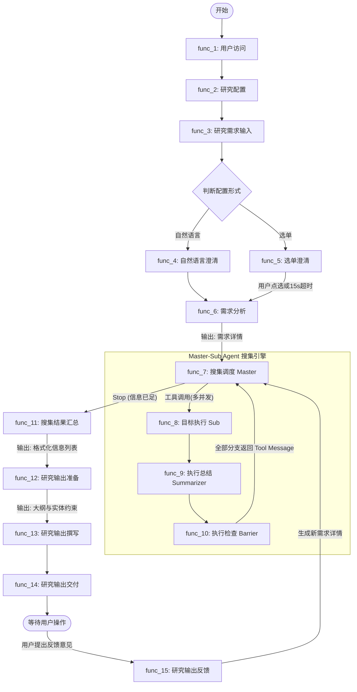
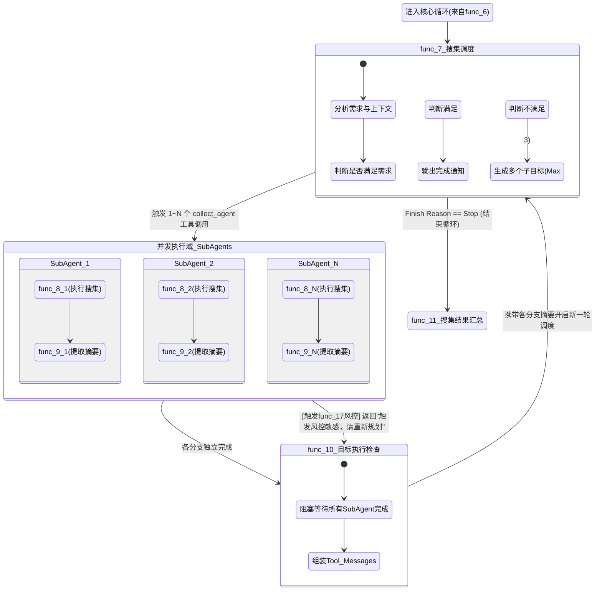

# Mimir_v1.0.0_prd_0.4

# 版本历史

| 文档版本 | 变更内容 | 变更时间 | 变更人 |
| --- | --- | --- | --- |
| 0.1 | 初次编写 | 2026.03.09 | 郑翰文 |
| 0.2 |   • 新增测试驱动开发的实施要求
  • 完善风控跳过逻辑（func_17） | 2026.03.11 | 郑翰文 |
| 0.3 |   • 在 func_7 中新增工具触发次数上限
  • 在 func_8 中新增工具调用次数的 prompt 约束
  • 调整 func_15 的重启逻辑，不删除已收集信息
  • 在 func_20 中新增「被终止任务」的数据删除策略
  • 新增 func_22 处理断连情形 | 2026.03.12 | 郑翰文 |
| 0.4 |   • 更新 func_7_搜集调度 的 system prompt
  • 更新 func_7_搜集调度 输入的 tools 描述
  • 更新 func_8_搜集目标执行 的 system prompt
  • 更新 func_8_搜集目标执行 的 user prompt（与当前实际实现对齐）
  • 更新 func_8_搜集目标执行 输入的 tools 描述
  • 调整 func_8_搜集目标执行中，web_fetch 工具的读取内容截断限制，从一万调整到五千
  • 将 func_7 中 `collect_agent.freshness_requirement` 保持为枚举语义，与当前实现一致 | 2026.03.23 | 郑翰文 |
| 0.5 |   • func_4 & func_5 需求澄清环节，为 LLM 新增搜索工具，调整 prompt | 2026.03.25 | 郑翰文 |

# 产品背景

Deep Research 类产品，使用大语言模型驱动，基于用户提供的问题、主题、目标，深度检索外部信息并分析，撰写深度研究报告内容，满足用户研究需求。

本产品基于 web 端交互，现阶段定义为轻量级演示 demo，重点在于用户侧核心流程，不完全覆盖完善的系统需求和外围 use case。

> Mimir 是北欧神话中的智慧巨人，智慧之泉的主人，象征着知识与智慧，我们将其选作产品的名称，希望这款产品能够像 Mimir 拥有最深邃的智慧、帮助用户解决问题
> 

# 名词说明

| 名词 | 定义 | 备注 |
| --- | --- | --- |
| **Mimir** | 产品名称，在本文档中代指产品本身。 | 取自北欧神话智慧巨人 |
| **用户** | 实际使用产品进行深度研究的角色。 |  |
| **开发者** | Mimir 的开发者角色，在开发者视角的需求中出现。 |  |
| **研究任务** | 从用户输入需求开始，到最终输出研究报告及图表，视为一个完整的系统运转周期。 |  |
| **初始需求** | 在单次研究任务中，用户在首页自然语言输入框中初次输入的研究主题或目标。 |  |
| **需求澄清** | Mimir 基于初始需求，发现信息缺失或模糊点后，通过自然语言或选单形式向用户发起的追问过程，旨在明确研究边界。 | 对应 func_4, func_5 |
| **需求详情** | 经过需求分析后输出的**结构化（JSON格式）需求定义**，包含核心目标、垂域、明细、输出形式和时效要求，是后续所有 Agent 工作的核心准则。 | 对应 func_6 输出 |
| **主控 (Master Agent)** | 在系统中扮演“大脑”和“调度器”角色的智能体。负责评估现有信息、规划下一步搜集目标，并发起工具调用分配任务给子智能体。 | 对应 func_7 搜集调度 |
| **智能体 (Agent)** | 能够使用大语言模型（LLM）进行推理规划，并自主调用外部工具（Tools）执行特定任务的 AI 实体。 |  |
| **子智能体 (Sub Agent)** | 由主控按需创建的独立执行单元（即 `collect_agent`），负责针对单一具体目标，使用搜索引擎和网页抓取工具获取底层信息。 | 对应 func_8 目标执行 |
| **执行摘要** | 子智能体完成单次搜集后，由大模型从原始搜集结果中提炼的 5-10 条关键发现。用于轻量化地向主控汇报，防止主控上下文超限。 | 对应 func_9 输出 |
| **同源去重** | 在汇总阶段的数据处理机制。指将所有信息源链接（URL/link）相同的多条搜集结果进行合并，保留唯一来源标题的动作。 | 对应 func_11 |
| **大纲与实体约束** | 研究正式撰写前生成的“施工图纸”。“大纲”定义了报告的章节与结构；“实体约束”定义了正文必须围绕描写的具体对象（如公司名、技术名词等），确保行文不跑题。 | 对应 func_12 |
| **工具调用 (Tool Call)** | 智能体在运行过程中，按需触发预定义外部能力的动作。例如调用 `web_search` 搜索、`python_interpreter` 画图等。 |  |
| **风控异常** | 系统在调用大模型或搜索接口时，因触发外部服务商（如智谱）的安全合规、敏感词拦截策略（如 1301 业务错误码）而产生的请求中断。 | 对应 func_17 |

# 用户功能需求

## E2E User story in one sentence

用户提供要研究的诉求，Mimir 基于用户诉求进行深度、多轮信息检索，最终基于搜集结果和 LLM 自身世界知识撰写报告并输出。

## User story list

| # | title | stories | remarks |
| --- | --- | --- | --- |
| 1 | 访问 | 用户要访问 Mimir 产品链接，以开始使用 |  |
| 2 | 研究设置 | 用户在开始实际研究前，对 Mimir 进行快速配置，以让 Mimir 按照用户习惯进行研究 |  |
| 3 | 需求输入 | 用户通过自然语言输入的方式，提供要研究的主题/目标，以开始研究 |  |
| 4 | 需求澄清 | 用户需要 Mimir 基于初始需求给出专业、合理的追问，并允许用户对追问进行澄清，以明确研究需求和边界，进而提升研究质量 |  |
| 5 | 研究规划与检索 | 用户需要 Mimir 基于前序输入，按需求进行研究的规划与检索，并看到 Mimir 的思考内容与行为，以明确知晓 Mimir 在做什么、为什么做，信息对称、焦虑环节和价值感知 |  |
| 6 | 研究撰写 | 用户需要 Mimir 基于已收集的信息和自身知识，撰写最终的深度研究输出，并观察撰写过程，信息对称、焦虑缓解和价值感知 |  |
| 7 | 研究结果查看 | 用户需要查看图文并茂的研究结果，并下载，以获取完整的研究结果 |  |
| 8 | 研究结果反馈 | 用户需要能基于已输出的研究结果，给出修改意见，Mimir 输出新的研究结果，以满足用户修正研究内容的需求 |  |

## user function list

| # | function name | description | remarks |
| --- | --- | --- | --- |
| 1 | 用户访问 | 用户访问 Mimir 地址，加载显示产品首页 |  |
| 2 | 研究配置 | 用户调整研究配置，使用配置控制即将开始的研究任务执行行为 |  |
| 3 | 研究需求输入 | 用户通过自然语言输入初始需求 |  |
| 4 | 需求澄清-自然语言 | Mimir 基于初始需求，生成自然语言追问问题，要求用户澄清需求细节，用户基于追问进行自然语言澄清 |  |
| 5 | 需求澄清-选单 | Mimir 基于初始需求，生成问题-选项形式的澄清选单，用户通过选择答案的方式进行澄清 |  |
| 6 | 需求分析 | 根据前序沟通记录，对用户研究需求进行深入分析，并整理为格式化、高质量的需求详情 |  |
| 7 | 搜集调度 | 根据需求详情，和已完成的所有目标信息，规划当前要搜集的单个/多个目标，或结束搜集 |  |
| 8 | 搜集目标执行 | 根据主控给出的目标和补充信息，使用外部工具进行信息的检索与收集，直至达成目标 |  |
| 9 | 目标执行总结 | 对目标执行的结果进行压缩，为主控规划提供依据 |  |
| 10 | 目标执行检查 | 检查主控规划的目标是否全部完成，触发新一轮主控规划 |  |
| 11 | 搜集结果汇总 | 汇总并格式化处理所有信息搜集结果 |  |
| 12 | 研究输出准备 | 根据信息收集结果和研究需求，准备研究大纲和图表支撑 |  |
| 13 | 研究输出撰写 | 根据全部信息收集结果、研究需求、大纲、图表，撰写研究输出内容 |  |
| 14 | 研究输出交付 | 面向用户展示/交付研究输出 |  |
| 15 | 研究输出反馈 | 用户基于研究输出的内容，提出反馈和修改意见，更新研究输出 |  |

## E2E flow

全局端到端工作流程图



## user function spec

### func_1_用户访问

用户访问 Mimir 地址，加载显示产品首页

1. 用户访问 Mimir web 地址，加载产品首页
2. 首页即为研究开始页面，包含
    - 用户自然语言输入框
    - 研究配置面板
3. 当前版本暂不涉及用户账户与管理相关内容

### func_2_研究配置

用户调整研究配置，使用配置控制即将开始的研究任务执行行为

当前版本仅支持单一配置调整：澄清形式

1. 可选两种澄清形式
    1. 自然语言澄清：在用户完成研究需求输入后，触发 `需求澄清-自然语言` 流程（func_4）
    2. 选单澄清：在用户完成研究需求输入后，触发 `需求澄清-选单` 流程（func_5）
2. 两种形式必须选择其一，默认选择自然语言澄清形式

### func_3_研究需求输入

用户通过自然语言输入初始需求

1. 用户在首页的自然语言输入框中输入研究需求
2. 最多 500 字/单词，支持换行
3. 输入完成后通过回车/按钮提交
4. 提交后，根据用户当前研究配置，进入对应澄清流程

### func_4_需求澄清-自然语言

基于初始需求，生成自然语言追问问题，要求用户澄清需求细节，用户基于追问进行自然语言澄清

1. 调用 LLM 生成自然语言的追问，参数与提示词模板如下
    - model name：glm-5
    - temperature：0.5
    - top_p：0.8
    - max tokens：98304
    - thinking
        - type：disabled
    - stream：true
    - system prompt：
    
    ```
    # 任务：
    你是一个深度研究智能体中的需求澄清助手，请根据用户原始需求，向用户追问研究细节，例如主题、目的等，不要追问用户已经提供的信息，不要超过 5 个问题。
    注意事项：
    1. 如果用户输入中包含你不了解的实体或概念，使用搜索工具进行查询，**最多调用一次**。
    2. 亲切自然地回应用户后，再引出具体问题，问题以编号形式列出，不要有额外内容。
    3. 平等地和用户交流，不要使用敬语。
    4. 你所在的报告撰写智能体支持图表（如饼状图、折线图），但是无法绘制图像，所以不要向用户追问类似需求。
    ```
    
    - user prompt：
    
    ```
    # 用户输入需求：
    {{#用户初始需求#}}
    # 当前时间：
    {{#当前时间#}}
    ```
    
    - tools
    
    ```json
    [
        {
            "type": "function",
            "function": {
                "name": "web_search",
                "description": "搜索工具，通过搜索引擎检索指定信息，返回搜索结果列表，包含网页摘要和对应 url",
                "parameters": {
                    "type": "object",
                    "properties": {
                        "search_query": {
                            "type": "string",
                            "description": "要搜索的关键词"
                        },
                        "search_recency_filter": {
                            "type": "string",
                            "enum": [
                                "oneDay",
                                "oneWeek",
                                "oneMonth",
                                "oneYear",
                                "noLimit"
                            ],
                            "description": "限定搜索结果的时间范围，最近一日、一周、一月、一年或不限制",
                            "default": "noLimit"
                        }
                    },
                    "required": [
                        "search_query"
                    ]
                }
            }
        }
    ]
    ```
    
2. web_search 工具
    - POST 请求
    - 请求地址：[https://open.bigmodel.cn/api/paas/v4/web_search](https://open.bigmodel.cn/api/paas/v4/web_search)
    - 认证：Bearer token，变量 `ZHIPU_API_KEY`
    - 请求入参
    
    ```
    {
        "search_query":"",  //由 LLM tool call 提供
        "search_engine":"search_prime",  //固定值
        "query_rewrite":false,  //固定值
        "count":10,  //固定值
        "search_recency_filter":"",  //由 LLM tool call 提供
    }
    ```
    
    - provider 响应样例如下；返回给模型的 tool message 统一标准化为：
    
    ```json
    {
        "success": true,
        "search_query": "",
        "search_recency_filter": "noLimit",
        "results": [
            {
                "title": "",
                "link": "",
                "snippet": "",
                "publish_date": null
            }
        ]
    }
    ```
    
    - 其中：
        - `results[].snippet` 来自 provider `search_result[].content`
        - `results[].publish_date` 直接保留 provider `search_result[].publish_date`；缺失时输出 `null`
        - `icon`、`media`、`search_intent` 等字段不回灌给模型
    
    - provider 响应样例如下
    
    ```json
    {
        "created": 1773209152,
        "id": "20260311140551574da95e96704530",
        "request_id": "20260311140551574da95e96704530",
        "search_intent": [
            {
                "intent": "SEARCH_ALWAYS",
                "keywords": "中国新能源汽车渗透率",
                "query": "中国新能源汽车渗透率"
            }
        ],
        "search_result": [
            {
                "content": "今年以来中 国新能源车销量增速较高，增长较为强劲。 从渗透率来看，今年一季度中国新能源乘用车渗透率为45.2%，较去年三、 四季度的48.4%和48.9%略有下降， ...",
                "icon": "",
                "link": "http://pdf.dfcfw.com/pdf/H3_AP202506101688241767_1.pdf?1749568912000",
                "media": "",
                "publish_date": "Jun 10, 2025",
                "refer": "ref_1",
                "title": "[PDF] 新能源汽车行业2025 年中期展望：渗透率保持快速上扬"
            },
            ……
            {
                "content": "2025年新能源汽车渗透率将达到55%左右，进入相对高质量的发展阶段。” 从新能源汽车车型结构来看，商用车的新能源化有望进入快速爬坡期，成为未来的新增长点。",
                "icon": "",
                "link": "http://www.news.cn/fortune/20250124/dc886900e44f4c47ab5672970e3e043f/c.html",
                "media": "",
                "publish_date": "Jan 24, 2025",
                "refer": "ref_9",
                "title": "2025年中国汽车业站上新起跑线 - 新华网"
            }
        ]
    }
    ```
    
3. 流式输出模型响应展示给用户
4. 用户通过输入框提供澄清反馈，提交后，直接基于用户反馈内容原文进入需求分析（func_6）

### func_5_需求澄清-选单

Mimir 基于初始需求，生成问题-选项形式的澄清选单，用户通过选择答案的方式进行澄清

1. 调用 LLM 生成选单式澄清内容，参数与提示词模板如下
    - model name：glm-5
    - temperature：0.5
    - top_p：0.8
    - max tokens：98304
    - thinking
        - type：disabled
    - stream：true
    - system prompt：
    
    ```
    # 任务：
    你是一个深度研究智能体中的需求澄清助手，请根据用户原始需求，向用户追问研究细节，例如主题、目的等，并为每个问题提供三个可能的答案选项（单选题）供用户直接选择。
    
    注意事项：
    1. 如果用户输入中包含你不了解的实体或概念，使用搜索工具进行查询，**最多调用一次**。
    2. 首先亲切自然地回应用户，然后引出具体问题和选项，**绝对禁止在结尾补充任何内容**。
    3. 通过有序列表提供问题，无序列表提供答案选项，不要追问用户已经提供的信息，不要超过 5 个问题。
    4. 生成的选项必须能够直接解答问题，保证用户选择后可以直接开始研究无需进一步提供澄清内容。
    5. 不要提供“以上皆可、无特殊要求、不限”或类似的无意义选项。
    6. 平等地和用户交流，不要使用敬语。
    7. 你所在的报告撰写智能体支持图表（如饼状图、折线图），但是无法绘制图像，所以不要向用户追问类似需求。
    ```
    
    - user prompt：
    
    ```
    # 用户输入：
    {{#用户初始需求#}}
    # 当前时间：
    {{#当前时间#}}
    ```
    
    - tools
    
    ```json
    [
        {
            "type": "function",
            "function": {
                "name": "web_search",
                "description": "搜索工具，通过搜索引擎检索指定信息，返回搜索结果列表，包含网页摘要和对应 url",
                "parameters": {
                    "type": "object",
                    "properties": {
                        "search_query": {
                            "type": "string",
                            "description": "要搜索的关键词"
                        },
                        "search_recency_filter": {
                            "type": "string",
                            "enum": [
                                "oneDay",
                                "oneWeek",
                                "oneMonth",
                                "oneYear",
                                "noLimit"
                            ],
                            "description": "限定搜索结果的时间范围，最近一日、一周、一月、一年或不限制",
                            "default": "noLimit"
                        }
                    },
                    "required": [
                        "search_query"
                    ]
                }
            }
        }
    ]
    ```
    
2. web_search 工具
    - POST 请求
    - 请求地址：[https://open.bigmodel.cn/api/paas/v4/web_search](https://open.bigmodel.cn/api/paas/v4/web_search)
    - 认证：Bearer token，变量 `ZHIPU_API_KEY`
    - 请求入参
    
    ```
    {
        "search_query":"",  //由 LLM tool call 提供
        "search_engine":"search_prime",  //固定值
        "query_rewrite":false,  //固定值
        "count":10,  //固定值
        "search_recency_filter":"",  //由 LLM tool call 提供
    }
    ```
    
    - provider 响应样例如下；返回给模型的 tool message 统一标准化为：
    
    ```json
    {
        "success": true,
        "search_query": "",
        "search_recency_filter": "noLimit",
        "results": [
            {
                "title": "",
                "link": "",
                "snippet": "",
                "publish_date": null
            }
        ]
    }
    ```
    
    - 其中：
        - `results[].snippet` 来自 provider `search_result[].content`
        - `results[].publish_date` 直接保留 provider `search_result[].publish_date`；缺失时输出 `null`
        - `icon`、`media`、`search_intent` 等字段不回灌给模型
    
    - provider 响应样例如下
    
    ```json
    {
        "created": 1773209152,
        "id": "20260311140551574da95e96704530",
        "request_id": "20260311140551574da95e96704530",
        "search_intent": [
            {
                "intent": "SEARCH_ALWAYS",
                "keywords": "中国新能源汽车渗透率",
                "query": "中国新能源汽车渗透率"
            }
        ],
        "search_result": [
            {
                "content": "今年以来中 国新能源车销量增速较高，增长较为强劲。 从渗透率来看，今年一季度中国新能源乘用车渗透率为45.2%，较去年三、 四季度的48.4%和48.9%略有下降， ...",
                "icon": "",
                "link": "http://pdf.dfcfw.com/pdf/H3_AP202506101688241767_1.pdf?1749568912000",
                "media": "",
                "publish_date": "Jun 10, 2025",
                "refer": "ref_1",
                "title": "[PDF] 新能源汽车行业2025 年中期展望：渗透率保持快速上扬"
            },
            ……
            {
                "content": "2025年新能源汽车渗透率将达到55%左右，进入相对高质量的发展阶段。” 从新能源汽车车型结构来看，商用车的新能源化有望进入快速爬坡期，成为未来的新增长点。",
                "icon": "",
                "link": "http://www.news.cn/fortune/20250124/dc886900e44f4c47ab5672970e3e043f/c.html",
                "media": "",
                "publish_date": "Jan 24, 2025",
                "refer": "ref_9",
                "title": "2025年中国汽车业站上新起跑线 - 新华网"
            }
        ]
    }
    ```
    
3. 模型预期输出格式示例如下

```
1. 问题 1
- 问题1_选项1
- 问题1_选项2
- 问题1_选项3
2. 问题 2
……
```

4. 按上述“有序列表为问题、问题后无序列表为选项”的预期格式，捕获对应内容，并通过交互式组件展示给用户，供用户直接点选
    1. 在模型输出选单基础上，固定在每个选项列表末尾增加 `自动` 选项
    2. 所有题目，默认选择 `自动` 选项
    3. 选单澄清过程中，不接受输入框输入
5. 从选单展示开始，倒计时 15s，自动进入需求分析（func_6）
    1. 若用户对任意选项进行调整，重新进行倒计时
    2. 用户可手动提交，跳过倒计时，直接进入需求分析（func_6）

### func_6_需求分析

根据前序沟通记录，对用户研究需求进行深入分析，并整理为格式化、高质量的需求详情

1. 调用 LLM 进行需求分析，生成需求详情，参数与提示词模板如下
    - model name：glm-5
    - temperature：0.5
    - top_p：0.8
    - max tokens：98304
    - thinking
        - type：disabled
    - stream：true
    - system prompt：
    
    ```
    <背景>
    你是一个研究报告撰写智能体中的需求分析器，<历史需求沟通></历史需求沟通>中是研究助手和用户的需求沟通记录，现在是{{#当前时间#}}。
    </背景>
    <任务>
    请根据历史需求沟通中的内容，深入分析然后汇总输出具体的用户需求。
    注意事项：
    1. 必须严格依据历史沟通内容进行分析
    2. 必须给出明确、具体、无歧义的分析结果，严禁出现模棱两可的推测。
    3. 按以下维度进行输出
    - 核心研究目标
    - 研究主题所属的垂域
    - 需求明细：仅限用户主动表达或反馈的需求细项（如有），绝对禁止自行杜撰、篡改、曲解！必须包含研究使用语言的分析，默认中文
    - 适用的研究输出格式（单选）：["通用","研究报告","商业报告","专业论文","深度文章","指南攻略","购物推荐"]
    - 是否对参考信息有高时效需求：是 or 否
    4. 直接输出结果，不要解释或询问。
    </任务>
    
    <输出格式>
    ```json
    {
    "研究目标":"",
    "所属垂域":"",
    "需求明细":"",
    "适用形式":"",
    "时效需求":""
    }
    ```
    </输出格式>
    ```
    
    - user prompt：
    
    ```
    <历史需求沟通>
    user：{{#用户初始需求#}}
    assistant：{{#需求澄清输出#}}
    user: {{#澄清内容#}}
    </历史需求沟通>
    ```
    
2. {{#需求澄清输出#}} 变量，根据当前流程实际触发的澄清形式，拼接对应的澄清内容（原始 LLM 输出）
3. {{#澄清内容#}}变量，构造逻辑如下
    1. 自然语言澄清时：直接拼接用户的自然语言反馈
    2. 选单澄清时：
        1. 拼接用户选择的选项内容
        2. 不拼接 `自动` 选项
4. 需求详情输出完成后，进入搜集调度（func_7）

### func_7_搜集调度

根据需求详情，和已完成的所有目标信息，规划当前要搜集的单个/多个目标，或结束搜集。

<aside>
💡

func_7_搜集调度和 func_8_搜集目标执行，本质上是一套 master agent & sub agent 架构的两个核心，构成了两层 agent 循环，是 Mimir 最重要的内核；整个 func_7 到 func_10 的核心循环状态图如下



</aside>

1. 调用 LLM 进行搜集调度，参数与提示词模板如下
    - model name：glm-5
    - temperature：1
    - top_p：1
    - max tokens：98304
    - thinking
        - type：enabled
        - clear_thinking：false
    - stream：true
    - system prompt：
    
    ```
    <背景>
    你是一个 deep research 团队中的信息搜集调度 agent，你负责根据用户的深度研究需求详情，和已经获得的信息摘要，规划调度接下来的信息收集目标。
    </背景>
    
    <工具>
    你有 `collect_agent` 工具可供使用，该工具会创建一个独立的 sub agent 进行基于目标的信息检索和收集，将信息格式化暂存并返回执行摘要；当需要搜集信息时，必须使用该工具。
    </工具>
    
    <任务>
    你应当按以下逻辑工作
    1. 仔细观察用户的需求详情和工具返回的执行摘要
    2. 细致分析已收集信息是否能够支撑用户的深度研究需求
    	2.1 若无法支撑：
    		- 定位缺失的内容，分析依赖关系和关键约束
    		- 规划接下来要执行的信息搜集目标
    		- 调用 `collect_agent` 工具执行
    	2.2 若能够支撑
    		- 输出信息收集完成的简短通知
    	2.3 若已经多次使用 `collect_agent` 工具（max tool calls=9），仍无有效进展
    		- 避免资源浪费，输出信息收集完成但不完整的简短通知
    
    注意事项
    1. 你并不需要一次性理清所有目标，而是根据已有信息进行动态规划。
    2. 你可以通过一次发起多个工具调用的方式，规划多个目标以提升收集效率
    	- 必须保证同时发起的多个`collect_agent`目标之间无逻辑顺序或依赖关系！
    	- 若串行执行能有效提升质量，优先进行串行执行，记住质量比效率更重要。
    	- 最多只能同时发起 3 个`collect_agent`工具调用。
    3. `collect_agent` 工具会将完整搜集结果暂存，供后续 agent 使用，因此信息搜集全部完成后无需提供任何结果信息，仅声明通知即可。
    </任务>
    ```
    
    - user prompt
    
    ```
    <需求详情>
    {{#需求详情#}}
    </需求详情>
    ```
    
    - tools
    
    ```json
    [
        {
            "type": "function",
            "function": {
                "name": "collect_agent",
                "description": "创建独立的信息收集 sub agent，针对单个明确的信息获取目标进行检索和搜集，执行完成后会自动将结果暂存，返回执行摘要",
                "parameters": {
                    "type": "object",
                    "properties": {
                        "collect_target": {
                            "type": "string",
                            "description": "信息获取目标"
                        },
                        "additional_info": {
                            "type": "string",
                            "description": "可辅助 sub agent、有助于其更快、更好达成收集目标的补充信息"
                        },
                        "freshness_requirement": {
    		                    "type": "string",
                                "enum": [
                                    "low",
                                    "high"
                                ],
    		                    "description": "该搜集目标对参考信息的时效要求"
                        }
                    },
                    "required": [
                        "collect_target"
                    ]
                }
            }
        }
    ]
    ```
    
2. 流式输出向用户展示 LLM 的 reasoning content，作为“规划思考”呈现
3. 若触发了工具调用，则展示调用时的 collect_target 信息，明确告知用户正在对具体目标进行搜集
    1. 限制 collect_target 工具的最大调用次数为 5 次
4. 每次进入搜集调度流程，调用 LLM 时
    1. 必须拼接当前研究任务中，搜集调度 LLM 的完整 agent loop 信息（collect_target 工具返回的 tools message 由 `func_9_目标执行总结` 提供），包括 reasoning content。
5. 后续流程流转逻辑，根据 LLM 输出：
    1. 触发 collect_agent 工具调用（finish reason 为 tools），且未达调用次数上限：进入搜集目标执行（func_8）
    2. 触发 collect_agent 工具调用（finish reason 为 tools），但是达到了调用次数上限：进入搜集结果汇总（func_11）
    3. 结束回合（finish reason 为 stop）：进入搜集结果汇总（func_11）

### func_8_搜集目标执行

根据主控给出的目标和补充信息，使用外部工具进行信息的检索与收集，直至达成目标

1. 调用 LLM 进行搜集目标执行，如果前序搜集调度同时发起了多个 collect_target 工具调用，则同时调用多个/开启多个 搜集目标执行 agent loop；参数与提示词模板如下
    - model name：glm-5
    - temperature：1
    - top_p：1
    - max tokens：98304
    - thinking
        - type：enabled
        - clear_thinking：false
    - stream：true
    - system prompt：
    
    ```
    <角色与背景>
    你是一个信息搜集 agent，负责根据用户目标搜集信息，现在是{{#当前时间#}}。
    </角色与背景>
    
    <任务>
    核心目标：基于用户的目标和补充信息，进行高质量的信息搜集和整理。
    你应当使用提供的搜索和网页读取工具，获得需要的信息，当决定下一步动作时，遵循以下逻辑：
    - 仔细观察并分析已有信息
    - 当未进行任何搜集，或已知信息不足时，按需设置合理的搜索工具参数进行搜集。
    - 在搜索列表中发现潜在的高价值信息时，使用网页读取工具获取详情。
    - 当你的历史上下文中，搜索结果或网页内容已足够支撑用户目标时，停止进一步搜集，输出信息搜集结果。
    - 若经过多轮工具调用仍无法达成或逼近目标（max_tool_calls = 10），则该目标本身可能就是无法触达的，为避免时间和资源浪费，停止搜集，输出已有的信息搜集结果。
    
    注意事项：
    - 注意信息获取目标的时效性要求，在检索时进行相关限制，在最终输出时只整理提供符合时效要求的内容。
    - 关注信源可信度和信息质量，忽略明显存在漏洞的信息和低可信度网站。
    - 最终输出搜集结果时，尽最大可能保留**高质量的关键信息和数据**，并且必须提供原始网页 url 和 title。
    </任务>
    
    <最终输出格式>
    按以下 json 模板输出最终的信息搜集结果，注意 json 内部字符的正确转义，以保证内容可解析。
    [
        {
            "info":"",  //你搜集到的关键信息或数据
            "title":"",  //该信息所属的原始页面title
            "link":""  //该信息所属的原始url链接
        }
    ]
    </最终输出格式>
    ```
    
    - user prompt
    
    ```
    <信息获取目标>
    {{#collect_target#}}
    </信息获取目标>
    
    <补充信息>
    {{#additional_info#}}
    </补充信息>
    
    <时效要求>
    {{#freshness_requirement#}}
    </时效要求>
    ```
    
    - tools
    
    ```json
    [
        {
            "type": "function",
            "function": {
                "name": "web_search",
                "description": "搜索工具，通过搜索引擎检索指定信息，返回搜索结果列表，包含网页摘要和对应 url",
                "parameters": {
                    "type": "object",
                    "properties": {
                        "search_query": {
                            "type": "string",
                            "description": "要搜索的关键词"
                        },
                        "search_recency_filter": {
                            "type": "string",
                            "enum": [
                                "oneDay",
                                "oneWeek",
                                "oneMonth",
                                "oneYear",
                                "noLimit"
                            ],
                            "description": "限定搜索结果的时间范围，最近一日、一周、一月、一年或不限制",
                            "defult": "noLimit"
                        }
                    },
                    "required": [
                        "search_query"
                    ]
                }
            }
        },
        {
            "type": "function",
            "function": {
                "name": "web_fetch",
                "description": "网页读取工具，可读取 url 获取其内容",
                "parameters": {
                    "type": "object",
                    "properties": {
                        "url": {
                            "type": "string",
                            "description": "要读取的网页链接"
                        }
                    },
                    "required": [
                        "url"
                    ]
                }
            }
        }
    ]
    ```
    
2. web_search 工具
    - POST 请求
    - 请求地址：[https://open.bigmodel.cn/api/paas/v4/web_search](https://open.bigmodel.cn/api/paas/v4/web_search)
    - 认证：Bearer token，变量 `ZHIPU_API_KEY`
    - 请求入参
    
    ```
    {
        "search_query":"",  //由搜集目标 agent tool call 提供
        "search_engine":"search_prime",  //固定值
        "query_rewrite":false,  //固定值
        "count":10,  //固定值
        "search_recency_filter":"",  //由搜集目标 agent tool call 提供
    }
    ```
    
    - provider 响应样例如下；返回给模型的 tool message 统一标准化为：
    
    ```json
    {
        "success": true,
        "search_query": "",
        "search_recency_filter": "noLimit",
        "results": [
            {
                "title": "",
                "link": "",
                "snippet": "",
                "publish_date": null
            }
        ]
    }
    ```
    
    - 其中：
        - `results[].snippet` 来自 provider `search_result[].content`
        - `results[].publish_date` 直接保留 provider `search_result[].publish_date`；缺失时输出 `null`
        - `icon`、`media`、`search_intent` 等字段不回灌给模型
    
    - provider 响应样例如下
    
    ```json
    {
        "created": 1773209152,
        "id": "20260311140551574da95e96704530",
        "request_id": "20260311140551574da95e96704530",
        "search_intent": [
            {
                "intent": "SEARCH_ALWAYS",
                "keywords": "中国新能源汽车渗透率",
                "query": "中国新能源汽车渗透率"
            }
        ],
        "search_result": [
            {
                "content": "今年以来中 国新能源车销量增速较高，增长较为强劲。 从渗透率来看，今年一季度中国新能源乘用车渗透率为45.2%，较去年三、 四季度的48.4%和48.9%略有下降， ...",
                "icon": "",
                "link": "http://pdf.dfcfw.com/pdf/H3_AP202506101688241767_1.pdf?1749568912000",
                "media": "",
                "publish_date": "Jun 10, 2025",
                "refer": "ref_1",
                "title": "[PDF] 新能源汽车行业2025 年中期展望：渗透率保持快速上扬"
            },
            ……
            {
                "content": "2025年新能源汽车渗透率将达到55%左右，进入相对高质量的发展阶段。” 从新能源汽车车型结构来看，商用车的新能源化有望进入快速爬坡期，成为未来的新增长点。",
                "icon": "",
                "link": "http://www.news.cn/fortune/20250124/dc886900e44f4c47ab5672970e3e043f/c.html",
                "media": "",
                "publish_date": "Jan 24, 2025",
                "refer": "ref_9",
                "title": "2025年中国汽车业站上新起跑线 - 新华网"
            }
        ]
    }
    ```
    
3. web_fetch 工具
    - POST 请求
    - 请求地址：[https://r.jina.ai/](https://r.jina.ai/)
    - 认证：Bearer token，变量 `JINA_API_KEY`
    - 请求入参
    
    ```json
    {
      "url": ""  \\由搜集目标 agent tool call 提供
    }
    ```
    
    - 响应网页 markdown，示例如下，**保留前五千字符**，返回到 tool message
    
    ```
    Title: Mcporter — ClawHub
    
    URL Source: https://clawhub.ai/steipete/mcporter
    
    Markdown Content:
    ℹ
    
    Purpose & Capability
    
    The skill's name/description are consistent with……
    ```
    
4. 每次调用搜集目标执行 LLM 时，必须拼接当前搜集目标中，完整的 agent loop 信息，包括 reasoning content
5. 流式输出向用户展示 LLM 的 reasoning content，作为“搜索思考”呈现
6. 若触发了工具调用
    1. web_search
        - 提示用户正在搜索，展示搜索使用的 query
        - 工具执行完成后，展示搜索结果中 title 的 list
    2. web_fetch
        - 提示用户正在浏览，展示正在查看的 url
7. 搜集目标执行 LLM 结束 agent 回合、输出信息搜集结果后（finish reason 为 stop），进入目标执行总结（func_9）；
    1. 信息搜集结果需要暂存，供搜集结果汇总环节使用

### func_9_目标执行总结

对搜索目标执行的结果进行压缩，为主控规划提供依据

1. 调用 LLM 进行目标执行总结，触发多个搜集目标执行时，每个信息搜集结果都要经过一次目标执行总结处理，参数与提示词模板如下
    - model name：glm-5
    - temperature：0.6
    - top_p：0.8
    - max tokens：98304
    - thinking
        - type：disabled
    - stream：true
    - system prompt：
    
    ```
    <背景与角色>
    你是一个关键信息总结助手，负责从搜索结果中提取关键信息与发现摘要，现在是{{#当前时间#}}。
    </背景与角色>
    
    <任务>
    分析搜集结果，寻找、提取和目标相关的关键发现摘要：
    - 提取5-10条关键发现
    - 必须与目标相关
    - 如果搜集结果中有不相关内容，直接忽略，不要提及
    使用 markdown 格式直接输出，不要解释或询问。
    </任务>
    ```
    
    - user prompt
    
    ```
    <信息获取目标>
    {{#collect_target#}}
    </信息获取目标>
    
    <目标补充信息>
    {{#additional_info#}}
    </目标补充信息>
    
    <使用的检索词>
    {{#search_query_list#}}
    </使用的检索词>
    
    <信息搜集结果>
    {{#信息搜集结果#}}
    </信息搜集结果>
    ```
    
2. 目标执行总结 LLM 输出完成后，提示用户该具体目标已完成，随后进入目标执行检查（func_10）

### func_10_目标执行检查

检查搜集调度的目标是否全部完成，触发新一轮主控规划

1. 检查当前轮次的搜集调度调用的 搜集目标执行 subagent 是否全部执行完成，且全部完成了目标执行总结
2. 全部完成后，将目标执行总结的输出，以 tool message 方式返回给 搜集调度 LLM ，触发新一轮 agent loop
    1. 有多个搜集目标执行 subagent 时，需分开不同的 tool message，并保证与搜集调度发起的 tool call 对应

### func_11_搜集结果汇总

汇总并格式化处理所有信息搜集结果

1. 识别、提取本次研究任务中，所有「搜集目标执行」环节输出的「信息搜集结果」，合并为单个 json 数组
2. 合并完成后，对数组中的对象进行同源去重
    1. “同源信息”定义：所有”link”相同的 json 对象
    2. 合并所有同源信息的”info”，按顺序拼接”info”内的内容，以换行符分隔
    3. 若多个同源信息之间，”title”不同，则只保留首个同源信息中的”title”
    4. 去重后输出为单个 json 对象（info、title、link）
3. 同源去重后，按顺序对数组中所有对象进行编号
    1. 每个对象新增键“refer”
    2. refer 值模板：ref_n
4. 整个处理过程中，提示用户“信息收集完成，正在处理”
5. 全部处理完成后，得到「格式化信息列表」，进入研究输出准备（func_12）

### func_12_研究输出准备

根据格式化信息列表和研究需求，准备研究大纲和图表支撑

1. 调用 LLM 进行研究输出准备，参数与提示词模板如下
    - model name：glm-5
    - temperature：1
    - top_p：1
    - max tokens：98304
    - thinking
        - type：enabled
        - clear_thinking：false
    - stream：true
    - system prompt：
    
    ```
    <背景与任务>
    你是一个深度研究架构师，请基于用户研究需求和信息获取结果，规划深度研究的实体约束和大纲结构。
    你的任务是定义‘写什么’和‘怎么写’，你**绝对不能**撰写具体内容，你的产出将作为指令发送给下游的“撰写员”，当前时间是{{#当前时间#}}。
    1. 紧密围绕用户需求设计大纲，保证研究内容前后逻辑合理、通畅无前后冲突。
    1.1 正文内部结构仅下探一级。
    1.2 其中章节描述内容**必须**满足以下要求
    - 指令性语气：使用“分析”、“评估”、“通过...展示...”、“重点讨论”等词汇。
    - 元数据视角：描述该章节的**功能**和**范围**，而不是**结果**。
    - 数据占位符：不要写出具体的数字（如 "92%"），而要写“引用相关统计数据”或“量化分析需求度”。
    - 实体抽象化：不要过度罗列具体实体，除非它们是章节标题的主体。应使用“选取代表性XX”、“对比主流XX”等抽象化表述。
    2. 指定当前研究的实体列表，此处的实体指要撰写的研究内容本身要围绕的对象。
    3. **实体约束与大纲必须严格考量信息获取结果，保证已有信息可支撑**。
    <背景与任务>
    
    <输出格式>
    参考以下 json 格式直接输出你的生成结果。
    {
        "research_outline": {
            "标题": {
                "title": ""
            },
            "section_1": {
                "title": "",
                "description": ""
            },
            ……
            "section_n": {
                "title": "",
                "description": ""
            },
            "参考来源": {
                "title": "参考来源",
                "description": "列明所有参考来源"
            }
        },
        "entities": []
    }
    </输出格式>
    ```
    
    - user prompt
    
    ```
    <用户研究需求>
    {{#需求详情#}}
    </用户研究需求>
    
    <信息获取结果>
    {{#格式化信息列表#}}
    </信息获取结果>
    ```
    
2. 准备过程中，提示用户“正在构思”
3. 研究准备 LLM 输出完成后，得到「大纲与实体列表」，进入研究输出撰写（func_13）

### func_13_研究输出撰写

根据全部信息收集结果、需求详情和大纲与实体列表，撰写研究输出内容

1. 调用 LLM 进行研究输出撰写，参数与提示词模板如下
    - model name：glm-5
    - temperature：1
    - top_p：1
    - max tokens：98304
    - thinking
        - type：enabled
        - clear_thinking：false
    - stream：true
    - system prompt：
    
    ```
    # 背景与任务
    现在是{{#当前时间#}}，你是一个资深研究员，你负责利用已获取信息和你自身的世界知识，基于研究大纲撰写一篇满足用户研究需求的深度研究内容（markdown）。
    
    ## 正文撰写
    - 你的分析与研究应该深入细致，避免直接使用已获取信息中的原文。
    - 研究输出必须紧密围绕用户需求，**保证研究内容前后逻辑连贯、合理且清晰、上下文实体一致无冲突。**
    - 保证每个章节、段落中的内容充实性与研究深度，不要单纯地罗列信息或数据。
    - 注意，针对购买推荐类需求必须给出具体的购买建议和参考价格。
    - 提供的参考信息中的每条信息都已通过[ref_n]的方式编号，你需要在正确、合理的位置根据实际使用的参考信息创建脚注参考。
    - 在输出末尾添加脚注，保证对应关系正确。
    - **！重要！绝对不要超过一万字！**。
    
    ## 计算与图表
    如果需要进行数学计算、分析或图表绘制，请使用 `python_interpreter` 工具
    - 图表绘制完成后，依据真实创建的图片信息，在输出中正确的位置添加 markdown 图片引用
    
    ## 输出
    以 markdown 格式直接输出全文。
    ```
    
    - user prompt
    
    ```
    <参考信息>
    {{#格式化信息列表#}}
    </参考信息>
    
    <研究需求>
    {{#需求详情#}}
    </研究需求>
    
    <大纲与实体约束>
    {{#大纲与实体列表#}}
    </大纲与实体约束>
    ```
    
    - tools
    
    ```
    [
        {
            "type": "function",
            "function": {
                "name": "python_interpreter",
                "description": "执行 Python 代码进行数学计算、数据分析或图表绘制。代码应在隔离环境中运行，绘图请使用 matplotlib/seaborn 并将图表以 png 保存到当前目录",
                "parameters": {
                    "type": "object",
                    "properties": {
                        "code": {
                            "type": "string",
                            "description": "完整的 Python 代码"
                        }
                    },
                    "required": [
                        "code"
                    ]
                }
            }
        }
    ]
    ```
    
2. python_interpreter 工具
    1. 在独立沙箱 python 环境中执行代码
    2. 满足必要的安全限制
    3. 支持按需暂存文件（图片）
3. 每次调用输出撰写 LLM 时，必须拼接完整的 agent loop 信息，包括 reasoning content
4. 进入撰写环节时，提示用户正在准备撰写
5. 若触发了工具调用（python_interpreter）
    1. 提示用户正在运算
6. 流式输出向用户展示最终的 content 内容
7. 进入研究输出交付（func_14）

### func_14_研究输出交付

面向用户展示/交付研究输出

1. 研究输出撰写，开始流式后，实时展示，直到输出完成
    1. 正确渲染输出的 markdown 格式
    2. 需捕获输出的 markdown 图片引用，并渲染对应的图片
2. 全部输出完成后，支持用户手动下载，提供两种下载模式
    1. markdown 下载：提供包含 markdown 文件+图片的打包 zip 文件
    2. PDF 下载：将图文输出转换为 PDF 后下载
3. 单次研究任务至此结束

### func_15_研究输出反馈

用户基于研究输出的内容，提出反馈和修改意见，更新研究输出

1. 单次研究任务完成后，在不手动开启新研究的情况下，用户可通过自然语言输入框，提出针对当前研究的反馈意见
2. 用户输入并提交后，调用 LLM 进行反馈需求分析，参数和提示词模板如下
    - model name：glm-5
    - temperature：0.5
    - top_p：0.8
    - max tokens：98304
    - thinking
        - type：disabled
    - stream：true
    - system prompt：
    
    ```
    <背景>
    你是一个研究报告撰写智能体中的需求分析器，，现在是{{#当前时间#}}。
    <上一轮研究需求></上一轮研究需求>中是用户上一轮的研究报告需求；
    <本次调整意见></本次调整意见>中是用户本轮的最新消息。
    </背景>
    <任务>
    请结合用户上一轮的研究需求和本轮最新消息，重新深入分析然后汇总输出具体的用户需求。
    注意事项：
    1. 必须严格依据历史沟通内容进行分析
    2. 必须给出明确、具体、无歧义的分析结果，严禁出现模棱两可的推测。
    3. 按以下维度进行输出
    - 核心研究目标
    - 研究主题所属的垂域
    - 需求明细：仅限用户主动表达或反馈的需求细项（如有），绝对禁止自行杜撰、篡改、曲解！必须包含研究使用语言的分析，默认中文
    - 适用的研究输出格式（单选）：["通用","研究报告","商业报告","专业论文","深度文章","指南攻略","购物推荐"]
    - 是否对参考信息有高时效需求：是 or 否
    4. 直接输出结果，不要解释或询问。
    </任务>
    
    <输出格式>
    ```json
    {
    "研究目标":"",
    "所属垂域":"",
    "需求明细":"",
    "适用形式":"",
    "时效需求":""
    }
    ```
    </输出格式>
    ```
    
    - user prompt：
    
    ```
    <上一轮研究需求>
    {{#需求详情#}}
    </上一轮研究需求>
    <本次调整意见>
    {{#本轮反馈消息#}}
    </本次调整意见>
    ```
    
3. 处理完成后
    1. 使用研究反馈 LLM 的输出，替换{{#需求详情#}}变量
    2. 回到「搜集调度（func_7）」

# 系统功能需求

## sys function list

| # | function name | description | remarks |
| --- | --- | --- | --- |
| 16 | 通用异常处理 | LLM 或工具服务，API响应异常时的处理 |  |
| 17 | 风控异常处理 | LLM 或工具服务，API触发风控异常时的处理 |  |
| 18 | 后端解耦 | 后端的独立解耦输出能力 |  |
| 19 | 实施与部署预期 | 产品的部署与使用方式预期 |  |
| 20 | 数据存储 | 研究相关数据产物的存储逻辑 |  |
| 21 | 使用限制 | 避免服务滥用的简单限制 |  |
| 22 | 断连策略 | 页面刷新、关闭等前端断连情况的处理 |  |

## sys function spec

### func_16_通用异常处理

LLM 或工具服务，API响应异常时的处理

除风控敏感词类异常以外（详见 func_17），遵循以下通用处理逻辑

1. 等待 3s，重试请求
2. 请求次数上限 3 次
    1. 超限前请求成功，继续流程
    2. 超限后仍未成功，终止研究任务，提示用户服务异常，用户可选查看原始报错内容

### func_17_风控异常处理

LLM 或工具服务，API触发风控异常时的处理

1. **仅针对以下两类调用，做特殊的风控异常识别**
    - LLM 调用
    - web_search 工具调用
2. 风控识别：上述两类服务，响应码由两部分组成：外层是 HTTP 状态码，内层是响应体正文中的定义的业务错误码，提供了更具体的错误描述。风控的对应的编码是
    - HTTP 状态码：400
    - 业务错误码：1301
    - 触发风控时返回示例如下
    
    ```
    {
        "contentFilter": [
            {
                "level": 1,
                "role": "search"
            }
        ],
        "error": {
            "code": "1301",
            "message": "系统检测到输入或生成内容可能包含不安全或敏感内容，请您避免输入易产生敏感内容的提示语，感谢您的配合。"
        }
    }
    ```
    
3. 识别到两类服务风控报错时，按所处阶段
    1. 若处于搜集目标执行、目标执行总结、目标执行检查阶段（func_8~10）
        - 终止当前搜集调度的 collect_agent 回合
        - 将“触发风控敏感，请重新规划”作为 collect_agent 工具返回的 tool message，返回调用搜集调度，继续搜集调度的 agent loop
        - 每次研究任务，触发上限为 2 次，超过上限后直接终止研究任务，提示用户风控异常
    2. 若处于其他任意阶段
        - 终止研究任务，提示用户风控异常

### func_18_后端解耦

后端的独立解耦输出能力

技术实施时，要保证前后端的正确解耦与合理配合机制，目标是保证其后端，在未来有独立对外提供完整 API 服务的输出能力。

### func_19_实施与部署预期

产品的实施、部署与使用方式预期。

***为保证制品质量和实施顺畅，Mimir 必须使用 TDD（Test-driven development）方法进行开发。***

轻量级演示 demo 定位，但是要提供公网访问，因此服务与存储都需要部署于云服务器，满足低访问量演示需求即可

### func_20_数据存储

研究相关数据产物的存储逻辑

1. 所有研究任务相关数据与产物，在用户开启新任务后立即删除，不做长期存储
2. 被终止的研究任务（任何原因），终止同时立即删除相关数据与产物，不做长期存储
3. 针对未手动开启新任务的情形，任务相关数据与产物默认保存 30 分钟，之后立即删除

### func_21_使用限制

避免服务滥用的简单限制

因为仅作轻量级演示 demo 用途，因此不设计用户和账户体系，使用基于 IP 的方式做访问限制以避免滥用

1. 同一时刻，全局仅支持一个研究任务执行，若有新研究任务请求，提示用户资源有限需等待
2. 同一 IP，24 小时内最多可创建 3 个研究任务，超过限额提示用户资源受限，以及下一次任务可用时间

### func_22_断联策略

页面刷新、关闭等前端断连情况的处理

1. 关闭/刷新页面，或其他前端断连情形，视为放弃任务，直接终止研究任务
    1. 针对浏览器页面关闭/刷新行为，需触发信息丢失提醒的二次确认
